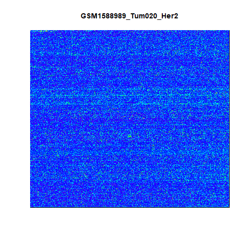
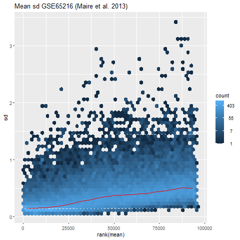
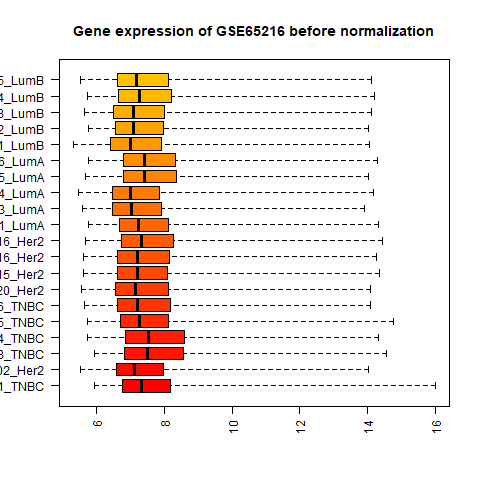
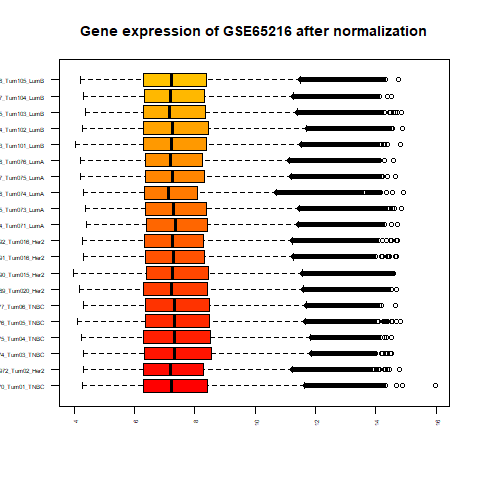
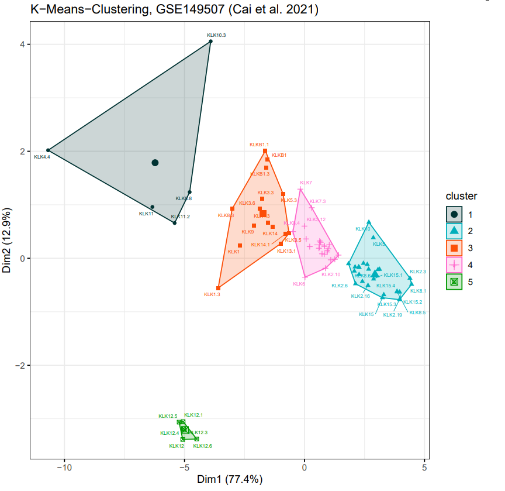

\pagenumbering{gobble}
\pagebreak
\tableofcontents
\pagebreak
\pagenumbering{arabic}

```{r setup, include=FALSE}
knitr::opts_chunk$set(fig.width=12, fig.height=8)
```


```{r Load Libaries, include=FALSE}
library(affy)
library(vsn)
library(AnnotationDbi)
library(hgu133plus2hsenstcdf)
library(hgu133plus2hsenstprobe)
library(hexbin)
library(ggplot2)
library(pheatmap)
library(dendextend) #install.packages("dendextend")
library(factoextra) #install.packages("factoextra")
library(gtools) #install.packages("gtools")
library(plyr)
library(tidyverse) #install.packages("tidyverse")
library(ggfortify)
library(patchwork)
library(RColorBrewer) #install.packages("RColorBrewer")
#library(dendextend) #install.packages("dendextend")
library(ggdendro) #install.packages("ggdendro")
library(here)
#set the top level folder with here
here::here()
```

```{r Read CEL Files, include=FALSE}
#creating a list of the CEL file names, for all three data sets
setwd(here("Rawdata/GSE65216 breast cancer TNBC Her2 LumA LumB"))
cels.breast <- list.files(pattern = 'CEL')

setwd(here("Rawdata/GSE149507 lung cancer"))
cels.lung <- list.files(pattern = 'CEL')
```
```{r Affybatch, include=FALSE}
#Breast 
breast <- ReadAffy(filenames = paste(here("Rawdata/GSE65216 breast cancer TNBC Her2 LumA LumB"), cels.breast, sep = "/"), verbose = TRUE)
breast@cdfName <- "HGU133Plus2_Hs_ENST"

orig.breast=colnames(exprs(breast))
new.breast <- substr(orig.breast, 1, nchar(cels.breast)-4)
colnames(exprs(breast)) <- new.breast
rownames(breast@phenoData) <- new.breast
rownames(breast@protocolData) <- new.breast

#Lung
lung <- ReadAffy(filenames = paste(here("Rawdata/GSE149507 lung cancer"), cels.lung, sep = "/"), verbose = TRUE)
lung@cdfName <- "HGU133Plus2_Hs_ENST"

orig.lung=colnames(exprs(lung))
new.lung <- substr(orig.lung, 1, nchar(cels.lung)-4)
colnames(exprs(lung)) <- new.lung
rownames(lung@phenoData) <- new.lung
rownames(lung@protocolData) <- new.lung

```


```{r Load in Data, include=FALSE}
breast.vsnrma <- vsnrma(breast)
breastExprs = exprs(breast.vsnrma)

lung.vsnrma <- vsnrma(lung)
lungExprs = exprs(lung.vsnrma)
```

# 1. Introduction

KLKs are a family of 15 mammalian secreted serine proteases. Analysis has shown that the KLK locus is most likely located on chromosome 19 and forms the largest cluster of contiguous proteases in the entire genome. (Yousef et al. 2000).  
All 15 kallikrein genes are proteolytic enzymes of steroid hormone regulation and are involved in the regulation of blood pressure, tissue remodeling, skin desquamation, and many other processes. The structure of KLK are similar with two beta-drums, two alpha-helices and a distinct loop involved in the regulation of activity and selectivity. Currently, the specific role of each kallikrein is unclear. It is known that they are involved in the complex regulatory processes, more specifically in those different signaling cascades.  
Dysregulation of KLKs are frequently associated with cancer. Their expression in different tissues and their involvement in different physiological processes make them potential tumor expression markers (Fischer and Meyer-Hoffert, 2013).  
Differential expression of different kallikrein genes has been found in different cancer types. While clear cell and papillary renal carcinomas have similar kallikrein expression profiles, chromophobe renal cell carcinoma has a unique expression profile (Tailor et al. 2018).


# 2. Quality control
After reading in our data, the first step is to verify its quality by following the steps presented in "R Course Micoarray Analysis" by Dr. Maria Dinkelacker (2019). The goal of quality control is to identify samples for which the data characteristics are significantly different. This significantly different expression would then be difficult to remove via variance stabilizing normalisation (vsn) and could interfere with the rest of the data. Samples that show odd characteristic will thereby be identified and replaced in the following quality control. The quality control is performed of the breast cancer microarray data set GSE65216 (Maire et al. 2013) and the small cell lung cancer microarray data set GSE149507 (Cai et al. 2021).

## 2.1 Quality control - GSE65216 breast cancer
### Single chip control
An example image of the scanned arrays is displayed. Upon examination of each array, there are no scratches or lighter areas detectable, which means the arrays themselves are fine.
<div style= "float:right;position: relative; top: -80px;">
```{r echo=FALSE, fig.show="hold", fig.align="center", fig.cap="Working chip of breast cancer microarray GSE65216", out.width="50%"}

```
</div>
### meanSd plot
The meanSd plot shows the standard deviation of the vsn normalized data, across all samples, plotted against the mean. Here, the logarithmic transformation consists with the base of 2.
```{r echo=FALSE, fig.align="center", fig.cap="meanSD plot of breast cancer microarray GSE65216", out.width="50%"}

```
### Boxplots before and after normalisation
It is clearly visible, that the differences in intensities between arrays is strongly reduced after normalisation. Also the boxplots only show little fluctuation in gene expression for the 20 arrays after normalisation. This means all chips adjudted through vsnrma normalisation
```{r Boxplots - breast qc, echo=FALSE, fig.align="center", fig.cap="Boxplots before and after normalisation breast cancer GSE65216", out.width="50%"}


```
### Density function
```{r Density - breast qc, echo=FALSE, fig.align="center", fig.cap="Density functions before and after normalisation breast cancer GSE65216", out.width="50%"}
knitr::include_graphics("images/breast_dflog_bfnorm.png")
knitr::include_graphics("images/breast_dflog_afnorm.png")
```
### RNA degeneration plot
 ---> MUSS NOCH GSE NUMMER IN PLOT ÜBERSCHRIFT EINGEFÜGT WERDEN
### Scatter plots
We plotted each sample against the following sample. If the scattered points deviate strongly from the red line, like for example forming a banana-like shape, then one of the respective chips for the sample must be broken. However this seems not to be the case here.
```{r Scatter plot - breast qc, echo=FALSE, fig.align="center", fig.cap="Example of scatter plot breast cancer GSE65216", out.width="50%"}
knitr::include_graphics("images/breast_scatter_example1.png")
```
## 2.2 Quality control - GSE149507 lung cancer
### Single chip control
### meanSd plot
### Boxplots before and after normalisation
### Density function
### RNA degeneration plot
### Scatter plots
The carcinoma tissue sample of patient number 5 did not show linear relationship to all of the other samples. Since the samples of dataset GSE149507 for normal and carcinoma tissue are linked to one patient each, we consequently replaced the two chips GSM4504109_SCLC_05_ca and GSM4504110_SCLC_05_ with new 2 new chips out of the gene expression omnibus. When performing the scatter plot control over again, there are no discrepancies anymore.
```{r Broken chip - lung qc, echo=FALSE, fig.align="center", fig.cap="Example of scatter plot breast cancer GSE65216", out.width="50%"}
knitr::include_graphics("images/breast_scatter_example1.png")
```

# 3. Further data acquistion
## Importing and unification of TRA data
To distinguish between TRA KLK genes and non-TRA KLK genes, we imported a total of 6 TRA data sets ((Su et al. 2002, 2004), (Roth et al. 2008), (Lattin et al. 2006), (human GTEX data 2015), (Uhlén et al. 2015)). Also below you can see an overview of the tissues that display TRAs in the context of the whole data set.

To get an overview about the distribution of Tissue Restricted Antigens, especially those that are Kallikrein genes, a pie chart was conducted.
A pie chart in general allows a quick overview and a first assessment of numerical distribution values. In this pie chart, the distribution of Tissue Restricted Kallikrein-Antigens is displayed. Notable is the high prevalence of prostatic kallikrein genes, as well as an occurrence in esophagus, thyroid and salivary gland. 
Starting by combining the six given TRA data sets, a fusion data frame was created. From this data frame, all genes that are KLKs are extracted. Since six data sets were combined, annotations for the same tissue were different, which needed to be fused manually. For the tissue “skin” as an example there were 3 tissues given: “skin”, “Skin – Sun exposed” and “Skin – not Sun exposed”. All those were combined into “skin”.


```{r TRA -piechart, echo=FALSE, fig.align="center", fig.cap="Tissue specificy of KLK genes", out.width="50%"}
knitr::include_graphics("images/piechart_TRA.png")

```


# 4. Expression Analysis
## Extraction of KLK and KLK TRA genes
With the unified TRA data set Union.TRA, it is possible to extract all KLKs that are tissue-restricted by their transcript number.
```{r Isolating KLK genes, eval=FALSE, include=FALSE, results=FALSE}
# All KLK genes
ind.all.KLK=grep("^KLK",symbol)
Kallikreins.all=symbol[ind.all.KLK]

ind.all.human =which(as.character(symbol) %in% as.character(Kallikreins.all)) 
Kallikreins<- as.character(Kallikreins.all)
Kallikreins

## For first breast cancer data set
all.KLK.rawdata = rawdataExprs[ind.all.human,]

## For breast GSE
all.KLK.breast = breastExprs[ind.all.human,]

## For lung GSE 
all.KLK.lung = lungExprs[ind.all.human,]


ind.KLK.all.human.tra <- which(as.character(names(symbol))  %in% 
as.character(unlist(tra.all.human[1])))

## For first breast cancer data set
TRA.KLK.rawdata = rawdataExprs[ind.KLK.all.human.tra,]

## For breast GSE
TRA.KLK.breast = breastExprs[ind.KLK.all.human.tra,]

## For lung GSE 
TRA.KLK.lung = lungExprs[ind.KLK.all.human.tra,]
```

## 4.2 Breast cancer GSE65216 (Maire et al. 2013)
The breast cancer microarray GSE65216 (Maire et al. 2013) chips consists of 20 samples. The samples are all breast cancer tissue differentiated by four types of mutations. These are Triple negative breast cancer (TNBC), Her2, Luminal A and Luminal B.  
### Clean up identical isoforms
Having a look onto the data set itself, it is noticeable, that some of the Expression values of the KLK isoforms in our microarray are exactly identical. These identical isoforms will be cleared out of our data frame. This is easily done by performing correlation, here the pearson correlation, between all KLK genes in a diagonal matrix. If the correlation yields a value of 1 then the two gene isoforms are the same and the latter one of both will be removed. Furthermore, the KLKs are sorted after their names in ascending order for the visualization via the boxplots. In the end, 39 identical isoforms are removed, whereas a total of 73 KLK transcripts for the 15 KLK genes are being kept. Out of the 73 isoforms, 63 are TRAs, while only 10 are regarded as tissue restricted.

### Visualization of gene expression
#### Overview gene expression
Since the data is vsnrma normalized, the median does not fluctuate too much for all samples. The lowest gene expression value is about 5 while the highest gene expression value is around 15. Due to the logarithmic scale with a base of 2, a log-fold change of +1 represents a two times as high gene expression. 
```{r Overview and Histogram breast cancer}
gene.summary <- function(x){
 round(apply(x, 2, summary), digits = 2)
}
gene.summary(breastExprs)
```
The histogram represent the frequency of the present gene expression in breast cancer samples. It also shows, that the median gene expression of KLKs is much lower than the overall median gene expression. This means that most of the KLK gene expression is normally down-regulated in the perspective of the whole genome. (Yousef et al. 2004)
```{r Histogram - breast , echo=FALSE, fig.align="center", fig.cap="Histogram of breast cancer gene expression", out.width="50%"}
knitr::include_graphics("images/Histogram_breast.png")
```


#### Boxplots
```{r Boxplot - breast , echo=FALSE, fig.align="center", fig.cap="Boxplot of KLK gene expression in breast cancer", out.width="50%"}
knitr::include_graphics("images/Boxplot_breast.png")
```
Here, the pattern for the fairly low gene expression of KLKs is also recognizable. Most of the boxpots of the single KLK gene isoforms are lower than the median expression of the whole breast cancer genome. Some KLK isoforms like KLK2.3 are even below a gene expression value of 6, so KLK isoforms like these are clearly down-regulated. This is compatible with the finding of Yousef et al. in which they state an overall down-regulation of KLK gene expression in breast cancer. There are only two isoforms that exceed the median of the whole genome expression of the breast cancer set. These are the isoforms KLK4.4 and KLK8.8.  
KLK4 gene expression was found by Schmitt et al. to be up-regulated in breast cancer tissue as in comparison to healthy breast tissue. This seems to correspond with the finding shown in the boxplot, but only for the KLK4.4 isoform. So KLK4.4 needs to be investigated more carefully. In contrast to that, KLK8 seems to be higher expressed in both normal and cancer tissue.(Schmitt et al. 2013)

#### Heatmap
The dendrogram is the core for the emerging clustering in heatmaps. Here, clustering is performed after the complete-linkage method. 
```{r Dendrogram - breast , echo=FALSE, fig.align="center", fig.cap="Dendrogram of KLK genes in breast cancer", out.width="50%"}
knitr::include_graphics("images/Dendrogram_breast.png")
```
Interesting in this respect is, that KLK4.4 forms its own branch independent of all the others. As already shown in the boxplot, KLK4.4 was distinctly up-regulated. Looking onto the other branches of the dendrogram, it is notable that besides KLK4.4 there are more possible clusters. To increase the clarity of the heatmap 3 distinguished are used. Optimal clusters via K-means will still be performed later on.  
```{r Heatmap - breast , echo=FALSE, fig.align="center", fig.cap="Heatmap of KLK gene expression in breast cancer", out.width="50%"}
knitr::include_graphics("images/Heatmap_breast.png")
```
KLK4.4 clearly stands out (cluster 2) with an overall higher expression across all sample. Furthermore, as it is annotated KLK4.4 belongs to TRA group. Also in cluster 1 the expression values are higher than in the third. In addition there are a few samples which seem to have up-regulated KLK isoforms. For instance, the tumor sample number 1 with TNBC got one of the highest expression values across the KLKs: KLK10.3, KLK6 and KLK5.

### PCA
The principal component analysis was conducted over the samples. Centering was enabled, while scaling was not included, due to the data being vsnrma normalized.  
```{r PCA variance - breast , echo=FALSE, fig.align="center", fig.cap="Variance plot of the principal components for breast cancer", out.width="50%"}
knitr::include_graphics("images/PCA_variance_breast.png")
```
The cumulative variance shows, that 72% of the total variance or of the total information is explained by the first 2 principal components (PCs). These two PCs are sufficient for the analysis of the distribution of the breast cancer samples across the loadings of the KLK gene expression.  
```{r PCA plot - breast , echo=FALSE, fig.align="center", fig.cap="PC1 vs. PC2 with their respective loadings for breast cancer", out.width="50%"}
knitr::include_graphics("images/PCAplot_breast.png")
```
The loadings consists of the (SHOW CODE OF THE PCA plot) the top 12 most differentiated KLK isoforms. This was conducted by adding up the values of the rotation matrix for each individual KLK isoform. As it is displayed in Fig. #NR some samples are more characterized by the expression of KLK11 and KLK11.2. This is mostly the case for two of the LumA samples. This was also observable in the heatmap by the higher expression of KLK11 in the tumor samples 71 and 76. 
Another result of the PCA is that TNBC mutations are affected by KLK5 and KLK6 expression, which is also observable in the heatmap. For the up-regulation of KLK5 and KLK6 for some of the TNBC samples it woud be interesting if this does also hold truth for a higher sample size. If so, KLK5 and KLK6 expression could presumably be used as biomarker for TNBC breast cancer.
We assume that KLK4.4 is not part of the top 10 loadings, since it is higher expressed across all tumor samples.

### K-means clustering

K-means was performed to be able to draw conclusions on characteristics and the distribution of different Kallikrein genes. Here, the optimal number k of clusters was determined in doing a Within Cluster Sum of Squares – plot, also called the elbow method. A kink in the curve of a plot, in which the number k of clusters is plotted against the within cluster sum of squares, displays the optimal number of k clusters. Rising numbers of k will not cause a significant decline in the within cluster sum of squares anymore. 
For the breast cancer GSE65216 data set, the Within Cluster Sum of Squares – plot predicted an optimal number of k = 6, so k-means was performed using 6 clusters. The function of k-means automatically reduces dimensions to 2 if a dataset consists of 3 or more dimensions, so the k-means clustering does not directly cluster genes of interest according to their expression values, but cluster according to two dimensions that are influenced by expression values, as those explain most of the variance of the data. Due to this influence, k-means is still suited for clustering and thus comparing KLK expression patterns. Outstanding cluster is here marked as cluster 1 in green, containing KLKs4.4 and KLK8.8. Those genes already stood out in the heatmap analysis. Interestingly, cluster 4 is also very distinct but on the very other direction on the graph of two dimensions.

```{r K-means plot - breast , echo=FALSE, fig.align="center", fig.cap="K-means cluster analysis with k = 6 clusters for the breast cancer data set", out.width="50%"}

knitr::include_graphics("images/kmeans_6_breast.png")

```

### Hypothesis testing
The expression values of the Kallikrein genes obtained from Marie et al. were not normally distributed. Therefore the Wilcoxon-Mann-Whitney-Test was used. First, cluster 1 (KLK4.4 and KLK8.8) were tested for overexpression against all other KLKs individually from the dataset. KLK4.4 (TRA) was significantly higher expressed than all other KLK genes from the dataset. Likewise, KLK8.8 (non-TRA) was significantly hiher expressed than all KLK genes, except KLK4.4. Those results conform with the observations from the heatmap and the k-means clustering. 
Cluster-4 (KLK5,5.3,6,10.3) was isolated in the k-means clustering. On the heatmap it was conspicuous that for some tumor types the genes of this cluster were higher expressed. Thus the upper-tail Wilcoxon-test was used. In contrast to Cluster-1, Cluster-4 could not be clearly identified as an overexpression cluster. KLK5.3 and KLK6 were higher expressed than two thirds of the other KLK genes, wereas KLK5,10.3 were not significantly higher expressed than most of the other KLKs.

The main characteristic of the dataset from Marie et al. is the subdivision into the different mutations (Her2, LumA, LumB, TNBC). In the heatmap four genes were identified, which were overexpressed in at least two of the five mutation specific chips. KLK10.3,6 for Her2, KLK11,11.2 for LumA. These four genes are also identified as one of the twelve main loadings of the PCA. 

```{r, Hypothesis test panel plot with significant bars, echo=FALSE, fig.align="center", fig.cap="Panel plot of the PCA loading genes with significant bars. *: p-value <= 0.5, **: p-value <= 0.01 ", out.width="50%"}
knitr::include_graphics("images/breast_panel_loadings_test.png")

```

The difference in expression between the mutations types, within a gene, were determined with the Wilcoxon-Mann-Whitney-Test. The significant differences are indicated in the panel plot with bars. Results: 
-LumB is not highly expressed in any gene
-Her2 only higher expressed in KLK8.4 and 8.5
-Pattern in significance: TNBC often higher expressed, in that case mostly significantly higher in comparison to Her2 and LumB
-apart from that no obvious pattern - unlikly to determine the Mutation type based on those KLK gene expression 


### Discussion

## 4.3 Lung cancer GSE149507 (Cai et al. 2021)
The lung cancer microarray GSE149507 (Cai et al. 2021) were taken out of 6 patients with small cell lung cancer. The healthy lung tissue is adjacent to the carcinoma and the data set thereby consists of a total of 12 samples.  

### Visualization of gene expression 
#### Overview gene expression
```{r Histogram - lung , echo=FALSE, fig.align="center", fig.cap="Histogram of lung cancer gene expression", out.width="50%"}
knitr::include_graphics("images/Histogram_lung.png")
```
#### Boxplots
```{r Boxplot - lung , echo=FALSE, fig.align="center", fig.cap="Boxplot of KLK gene expression in lung cancer", out.width="50%"}
knitr::include_graphics("images/Boxplot_lung.png")
```
#### Heatmap
```{r Dendrogram - lung , echo=FALSE, fig.align="center", fig.cap="Dendrogram of KLK genes in lung cancer", out.width="50%"}
knitr::include_graphics("images/Dendrogram_lung.png")
```

```{r Heatmap - lung , echo=FALSE, fig.align="center", fig.cap="Heatmap of KLK gene expression in lung cancer", out.width="50%"}
knitr::include_graphics("images/Heatmap_lung.png")
```
### PCA

```{r PCA variance - lung , echo=FALSE, fig.align="center", fig.cap="Variance plot of the principal components for lung cancer", out.width="50%"}
knitr::include_graphics("images/PCA_variance_lung.png")
```
The cumulative variance shows, that 84% of the total variance or of the total information is explained by the first 2 principal components (PCs). These two PCs are sufficient for the analysis of the distribution of the breast cancer samples across the loadings of the KLK gene expression.  
```{r PCA plot - lung , echo=FALSE, fig.align="center", fig.cap="PC1 vs. PC2 with their respective loadings for lung cancer", out.width="50%"}
knitr::include_graphics("images/PCAplot_lung.png")
```
### Clustering - kmeans

K-means performed for the lung cancer GSE149507 dataset showed an interesting and distinct cluster, which only consisted of KLK-subtypes of KLK12. Other genes that stood out in the heatmap analysis, for example KLK4.4 and KLK8.8, were found in the first cluster on the top left corner. The finding of optimal k clusters happened following the same procedure as for the breast cancer data set, described above. An optimal number of k = 5 clusters was determined using a Within Cluster Sum of Squares – plot.
```{r K-means plot - lung , echo=FALSE, fig.align="center", fig.cap="K-means cluster analysis with k = 5 clusters for the lung cancer data set", out.width="50%"}



```

### Hypothesis testing
The results of the PCA and the k-means indicate that for some KLKs the expression differs, between the cancerous and normal tissue. Since the data the data is not normally distributes (QQ-PLOT?) the Wilcoxon signed-rank test was applied. 


###Logistsic regression
KLKs are already used in cancer diagnostics to determine the tumor type of sample. Since expression patterns of many different genes are very complex and hard to interpret regression models are a helpful tool to determine the cancer type. 
For the lung cancer data used in this analysis a binary outcome for the mikrochips (cancer or normal tissue)  is possible. Therefore logistic regression was chosen. 
The basic assumtions for logistsic regression are:
1. Independency of errors, every observation has to be  separate from the others.
2. Linearity of the continuous variables in logit - the relationship between the variable and their logit transformed outcome should be linear. 
3. Absence of multicollinearity or redundancy.
4. No outliners with a strong influence. 
5. For every independent variable there should be at least ten outcomes (Jill C.Stoltzfus 2011). 

These assumptions reveal the shortcomings of the used data and explain the experienced problems with logistic regression. First, main limitation of the used dataset is the low number of included mikrochips (only 12, 6 from cancer and 6 from normal tissue). Therefore expected problems of high standard error and large beta-coefficients for the independent variables were in encountered when including more then one independent variable. This phenomenon of unstable models is also called overfit-model. In fact, even for most individual genes, which had been identified ro have an significant expression difference, the described problems were encountered. It is worth noting that the data was split into a training dataset of 7 mikrochips and a test dataset of 3 mikrochips. But even with all the available mikrochips, the standard error of all of the individual tested genes, except KLK1.3 and KLK12, could not be decreased significantly. 

Second, although genes with a correlation equal to one were removed, some genes are still highly correlating. This is primarily true for the different isoforms of the same gene, as visualized in figure x, plot B (hypothesis testing KLK12 and isoforms). Therefore, the effect of colliniarity would probably cause problems, even if more mikrochips were included. Hence a second cleanup, removing genes with high correlation (e.g. corr > 0.8), would be necessary. 

As mentioned above KLK1.3 and KLK12 (and its isoforms) were the only gene were the standard error were not abnormaly high, but the p-value (KLK1.3 p=0.199, KLK12 p=0.314) of the independent variable was, in both cases, not significant. Therefore, the prediction rate 

The 


### Discussion


## Text k means but for both
K-means was performed to be able to draw conclusions on characteristics and the distribution of different Kallikrein genes. Here, we first determined the optimal number k of clusters in doing a Within Cluster Sum of Squares – plot, also called the elbow method. A kink in the curve of a plot, in which the number k of clusters is plotted against the within cluster sum of squares, displays the optimal number of k clusters. Rising numbers of k will not cause a significant decline in the within cluster sum of squares anymore. 
For the lung cancer dataset, the Within Cluster Sum of Squares – plot predicted an optimal number of k = 5, so k-means was performed using 5 clusters. The function of k-means automatically reduces dimensions to 2 if a dataset consists of 3 or more dimensions, so the k-means clustering does not directly cluster genes of interest according to their expression values, but since dimension reduction always consists of variables that explain most of the variance of the data, in this case k-means is still suitable to compare clusters of Kallikrein genes.
K-means performed for the lung cancer dataset showed an interesting and distinct cluster, which only consisted of KLK-subtypes of Kallikrein 12. Kallikrein 4.4 was found on the top left corner.
For the breast-cancer dataset, an optimal number of k = 6 was determined. Here, another cluster was highly distinct, containing KLK 4.4, which is also examined in the hypothesis testing. Interestingly, here we could find the cluster containing Kallikrein of the top right corner, on the opposite side than in the lung cancer dataset.


# References

- Maire V, Némati F, Richardson M, Vincent-Salomon A et al. Polo-like kinase 1: a potential therapeutic option in combination with conventional chemotherapy for the management of patients with triple-negative breast cancer. Cancer Res 2013 Jan 15
- Cai L, Liu H, Huang F, Fujimoto J et al. Cell-autonomous immune gene expression is repressed in pulmonary neuroendocrine cells and small cell lung cancer. Commun Biol 2021 Mar 9
- Dinkelacker 2019. Chromosomal clustering of tissue restricted antigens, Dissertation, University Heidelberg, Germany.
- Dinkelacker 2007. A database of genes that are expressed in a tissue-restricted manner to analyse promiscous gene expression in medullary thymic epithelial cells. Diplomarbeit, Albert-Ludwigs-Universitaet, Freiburg, Germany.


