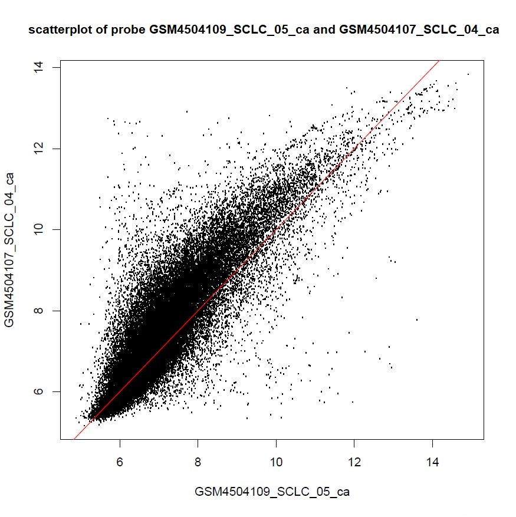
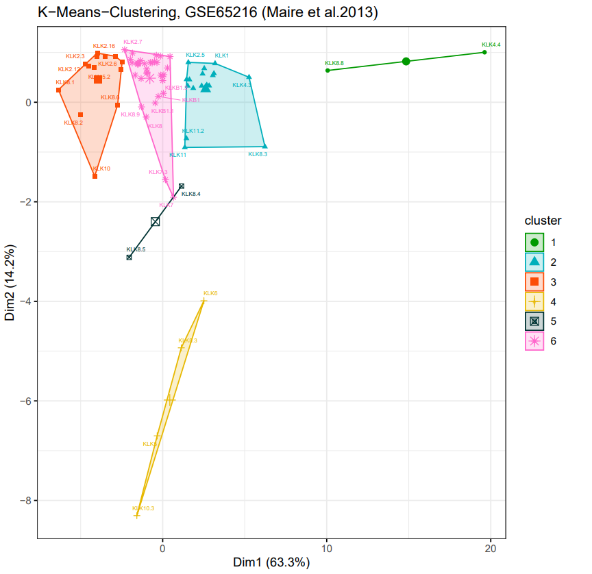
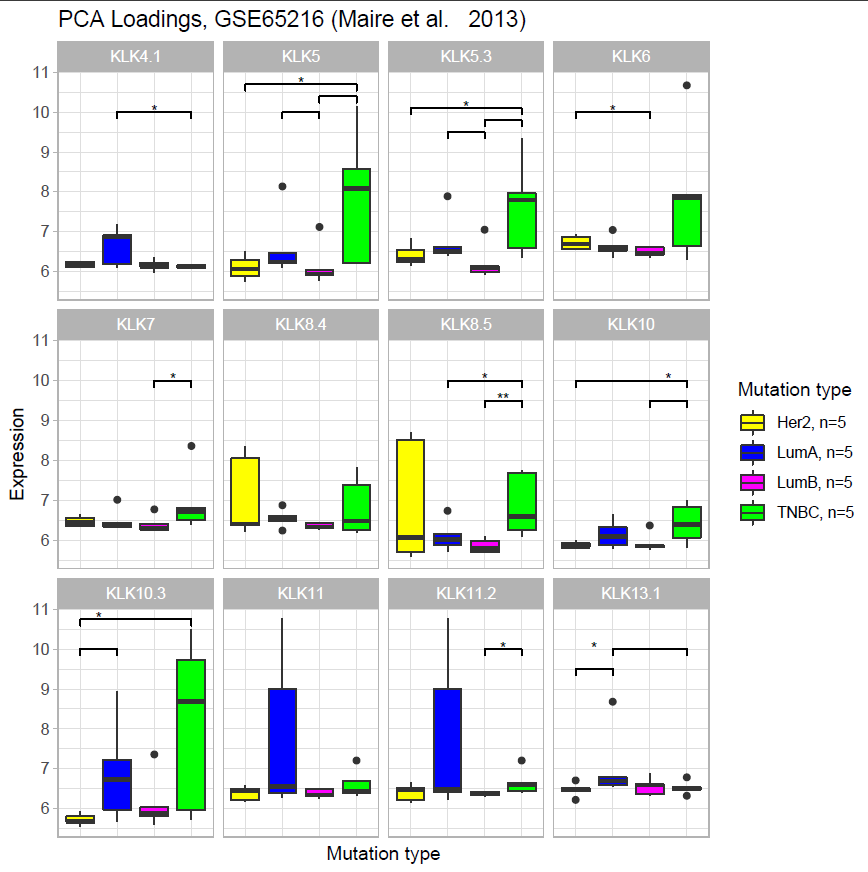
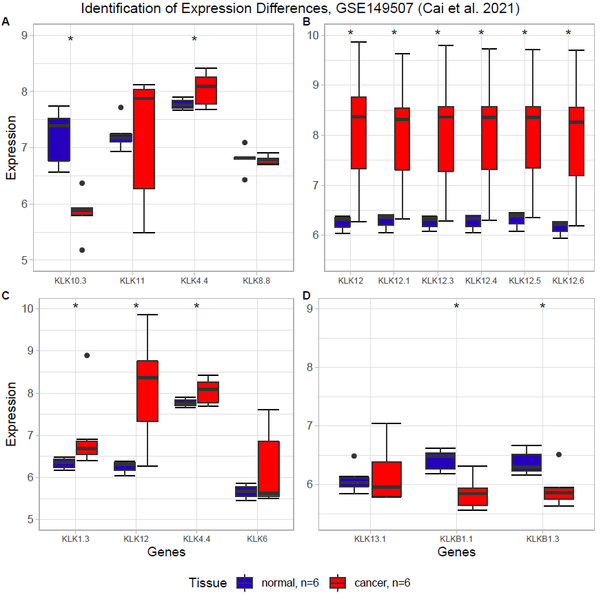

\thispagestyle{empty}
\hrule
\vspace{0.3cm}
\begin{center}
	\vspace{1cm}
  \large
	\begin{tabular}[c]{l}
	 \\

Anouk Dupe, David Eckey, Dustin Schilling, Maria Yemane \\
\\
	 \\
	Supervisor:
	Dr. Maria Dinkelacker \\
	 \\
	Tutor:
	Nils Mechtel \\
	 \\
	 \\
	Data Analysis for students of Molecular Biotechnology \\
	\\
	Heidelberg University 
	\vspace{0.3cm} \\
	\end{tabular}
	\end{center}

---

\pagenumbering{gobble}
\pagebreak
\tableofcontents
\pagebreak
\pagenumbering{arabic}

```{r setup, include=FALSE}
knitr::opts_chunk$set(fig.width=12, fig.height=8)
```

```{r Load Libaries, include=FALSE}
library(affy)
library(vsn)
library(AnnotationDbi)
library(hgu133plus2hsenstcdf)
library(hgu133plus2hsenstprobe)
library(hexbin)
library(ggplot2)
library(pheatmap)
library(dendextend) #install.packages("dendextend")
library(factoextra) #install.packages("factoextra")
library(gtools) #install.packages("gtools")
library(plyr)
library(tidyverse) #install.packages("tidyverse")
library(ggfortify)
library(patchwork)
library(RColorBrewer) #install.packages("RColorBrewer")
#library(dendextend)#install.packages("dendextend")
library(float) #install.packages("float")
library(ggdendro) #install.packages("ggdendro")
library(here)
#set the top level folder with here
here::here()
```


```{r Read CEL Files, eval=FALSE, include=FALSE}
#creating a list of the CEL file names, for all three datasets
setwd(here("Rawdata/GSE65216 breast cancer TNBC Her2 LumA LumB"))
cels.breast <- list.files(pattern = 'CEL')

setwd(here("Rawdata/GSE149507 lung cancer"))
cels.lung <- list.files(pattern = 'CEL')
```

```{r Affybatch, eval=FALSE, include=FALSE}
#Breast 
breast <- ReadAffy(filenames = paste(here("Rawdata/GSE65216 breast cancer TNBC Her2 LumA LumB"), cels.breast, sep = "/"), verbose = TRUE)
breast@cdfName <- "HGU133Plus2_Hs_ENST"

orig.breast=colnames(exprs(breast))
new.breast <- substr(orig.breast, 1, nchar(cels.breast)-4)
colnames(exprs(breast)) <- new.breast
rownames(breast@phenoData) <- new.breast
rownames(breast@protocolData) <- new.breast

#Lung
lung <- ReadAffy(filenames = paste(here("Rawdata/GSE149507 lung cancer"), cels.lung, sep = "/"), verbose = TRUE)
lung@cdfName <- "HGU133Plus2_Hs_ENST"

orig.lung=colnames(exprs(lung))
new.lung <- substr(orig.lung, 1, nchar(cels.lung)-4)
colnames(exprs(lung)) <- new.lung
rownames(lung@phenoData) <- new.lung
rownames(lung@protocolData) <- new.lung

```

```{r Load in Data, eval=FALSE, include=FALSE}
breast.vsnrma <- vsnrma(breast)
breastExprs = exprs(breast.vsnrma)

lung.vsnrma <- vsnrma(lung)
lungExprs = exprs(lung.vsnrma)
```


```{r Read ensembl, eval=FALSE, include=FALSE}

setwd(here("Tables"))

ensembl_df = read.csv("ensembl.103.txt",sep="\t")
```

```{r Dataset breast cancer, eval=FALSE, include=FALSE}
breastExprs <- breastExprs[grepl("ENST", rownames(breastExprs)), ]
dim(breastExprs) #  95659    20

# remove .x_at suffix
rownames(breastExprs) <- unlist(lapply(strsplit(rownames(breastExprs), split = "\\."), "[", 1))

setwd(here("Scripts"))

#Setting up annotation
transcriptIDs <- as.character(ensembl_df[, "Transcript.stable.ID"])
geneSymbol <- as.character(ensembl_df[, "HGNC.symbol"])
names(geneSymbol) <- transcriptIDs

# replace ensemble IDs with HGNC symbol
chipIDs.breast <- rownames(breastExprs)
noMatchIDs.breast <- chipIDs.breast[!chipIDs.breast %in% transcriptIDs]
# transcript IDs that are not in ensemble_103.txt
length(noMatchIDs.breast) #112

newChipIDs.breast <- chipIDs.breast[chipIDs.breast %in% transcriptIDs]
breastExprs <- breastExprs[newChipIDs.breast, ]
dim(breastExprs) ## 95547    10

symbol <- geneSymbol[newChipIDs.breast]
symbol.breast <- geneSymbol[newChipIDs.breast]
rownames(breastExprs) <- make.names(as.character(symbol.breast), unique = TRUE)  # Matrix to work with

head(breastExprs)
```


```{r Dataset lung cancer, eval=FALSE, include=FALSE}
lungExprs <- lungExprs[grepl("ENST", rownames(lungExprs)), ]
dim(lungExprs) #  95659    20
 
# remove .x_at suffix
rownames(lungExprs) <- unlist(lapply(strsplit(rownames(lungExprs), split = "\\."), "[", 1))

setwd(here("Scripts"))

# replace ensemble IDs with HGNC symbol
chipIDs.lung <- rownames(lungExprs)
noMatchIDs.lung <- chipIDs.lung[!chipIDs.lung %in% transcriptIDs]
# transcript IDs that are not in ensemble_103.txt
length(noMatchIDs.lung) #112

newChipIDs.lung <- chipIDs.lung[chipIDs.lung %in% transcriptIDs]
lungExprs <- lungExprs[newChipIDs.lung, ]
dim(lungExprs) ## 95547    10


# 
symbol.lung <- geneSymbol[newChipIDs.lung]
rownames(lungExprs) <- make.names(as.character(symbol.lung), unique = TRUE)  # Matrix to work with

head(lungExprs)

```


## 1. Introduction
Tissue-restricted antigens (TRAs) are good drug targets in cancer and cancer immunotherapy. In general, TRAs are genes, which are highly expressed in specific tissue compared to others (Kont et al., 2008). One group of TRAs are Kallikrein genes (KLK).
KLKs are a family of 15 mammalian secreted serine proteases. Analysis has shown that the KLK locus is located on chromosome 19 and forms the largest cluster of contiguous proteases in the entire genome. (Yousef et al., 2000).  
All 15 Kallikrein genes are proteolytic enzymes under steroid hormone regulation and are involved in the regulation of blood pressure, tissue remodeling, skin desquamation, and many other processes. The structure of KLK are similar with two beta-drums, two alpha-helices and a distinct loop involved in the regulation of activity and selectivity. Currently, the specific role of each Kallikrein is unclear. It is known that they are involved in the complex regulatory processes, more specifically in those different signaling cascades.  
Dysregulation of KLKs are frequently associated with cancer. Their expression in different tissues and their involvement in different physiological processes make them potential tumor expression markers (Fischer et Meyer-Hoffert, 2013).   Different expression of Kallikrein genes has been found in many cancer types.


## 2. Quality control
```{r Breast - Single Chip control, eval=FALSE, include=FALSE}
# read images for GSE65216 breast cancer TNBC Her2 LumA LumB
setwd(here("Plots/Plots_breast_qc"))
pdf("breast_chip_control.pdf")
image(breast, col=rainbow(100,start=0,end = 0.75)[100:1])
dev.off()

setwd(here("Plots/Plots_breast_qc"))
pdf("breast_chip_control_example1.pdf")
image(breast[,7], col=rainbow(100,start=0,end = 0.75)[100:1])
dev.off()

# the individual chips look fine
```

```{r Breast - Normalization and meanSd plot, eval=FALSE, include=FALSE}
## Normalization
breast.vsnrma <- vsnrma(breast)

setwd(here("Tables"))

save.image(file = "breastNorm.rda")

## MeanSdPlot
setwd(here("Plots/Plots_breast_qc"))
msd.breast <- meanSdPlot(breast.vsnrma)
msd.breast.title <- msd.breast$gg + ggtitle("Mean sd GSE65216 (Maire et al. 2013)")

pdf("breast_meansdPlot.pdf")
print(msd.breast.title)
dev.off()
###The line is approximately horizontal, so there shouldn't be a variance-mean dependence 
```

```{r Breast - Boxplots, eval=FALSE, include=FALSE}
##Boxplot before normalization
setwd(here("Plots/Plots_breast_qc"))

pdf("breast_box_bfnorm.pdf")
boxplot(breast, horizontal = TRUE , col=rainbow(150),cex.axis=0.5,main="Gene expression of GSE65216 before normalization", las = 2)
dev.off()

setwd(here("Plots/Plots_breast_qc"))
##Boxplot after normalization
pdf("breast_box_afnorm.pdf")
boxplot(exprs(breast.vsnrma),horizontal = TRUE,col=rainbow(150),cex.axis=0.5,main="Gene expression of GSE65216 after normalization" , las=2)
dev.off()
```

```{r Breast - Density function, eval=FALSE, include=FALSE}
## Density function before normalization
setwd(here("Plots/Plots_breast_qc"))

pdf("breast_dlogf_bfnorm.pdf")
hist(breast, col=rainbow(150), main = "GSE65216 (Maire et al. 2013) density function before normalization")
dev.off()

## Density function after normalization
##vsnrma
breastExprs = exprs(breast.vsnrma) ####IMPORTANT
setwd(here("Plots/Plots_breast_qc"))
pdf("breast_dflog_afnorm.pdf")
plot(density(breastExprs[,1]), type="n", xlab="log Intensity", main = "GSE65216 (Maire et al. 2013) density function after normalization")
for(i in 1:ncol(breastExprs)){
  lines(density(breastExprs[,i]), col=rainbow(150)[i])
}
dev.off()
```

```{r Breast - RNA deg Plot, eval=FALSE, include=FALSE}

## RNA degeneration plot
setwd(here("Plots/Plots_breast_qc"))
rnadeg.breast = AffyRNAdeg(breast)

pdf("breast_RNAdeg_ss.pdf")
plotAffyRNAdeg(rnadeg.breast, col = rainbow(150))
title(sub="GSE65216 (Maire et al. 2013)")
dev.off()

pdf("breast_RNAdeg_s.pdf")
plotAffyRNAdeg(rnadeg.breast, col = rainbow(150), transform = "shift.only")
title(sub="GSE65216 (Maire et al. 2013)")
dev.off()
```

```{r Breast - Scatter plots, eval=FALSE, include=FALSE}
# Scatter plots

setwd(here("Plots/Plots_breast_qc"))

pdf("breast_scatter.pdf")  
for(i in 1:21){
plot(breastExprs[,c(i, i+1)], pch=".")
abline(0,1,col="red")

title(main=paste("Scatterplot of probe", substr(colnames(breast.vsnrma)[i],1,
nchar(colnames(breast.vsnrma)[i])),"and",substr(colnames(breast.vsnrma)[i+1],1,
nchar(colnames(breast.vsnrma)[i+1])), sep = " ", collapse = NULL))

permission = readline(prompt = "type y for next image: ")

if(permission == "y"){
  
}
else{
break}
}
dev.off()

## None of the scatterplots seem to deviate significantly from the red line
```

```{r Lung - chip control, eval=FALSE, include=FALSE}
# read images for GSE149507 lung cancer
setwd(here("Plots/Plots_lung_qc"))
pdf("lung_chip_control.pdf") 
image(lung, col=rainbow(100,start=0,end = 0.75)[100:1])
dev.off()

setwd(here("Plots/Plots_lung_qc"))
pdf("lung_chip_control_example1.pdf")
image(lung[,7], col=rainbow(100,start=0,end = 0.75)[100:1])
dev.off()

# the individual chips look fine
```

```{r Lung - Normalization and meansd Plot, eval=FALSE, include=FALSE}
## Normalization
lung.vsnrma <- vsnrma(lung)

setwd(here("Tables"))

save.image(file = "lungNorm.rda")

## MeanSdPlot
setwd(here("Plots/Plots_lung_qc"))

msd.lung <- meanSdPlot(lung.vsnrma)
msd.lung.title <- msd.lung$gg + ggtitle("Mean sd GSE149507 (Cai et al. 2021)")

pdf("breast_meansdPlot.pdf")
print(msd.lung.title)
dev.off()

###The line is approximately horizontal, so there shouldn't be a variance-mean dependence 
```

```{r Lung - Boxplots, eval=FALSE, include=FALSE}
setwd(here("Plots/Plots_lung_qc"))

##Boxplot before normalization
pdf("lung_box_bfnorm.pdf")
boxplot(lung, horizontal = TRUE ,col=rainbow(150),cex.axis=0.5,main="GSE149507 (Cai et al. 2021) gene expression before normalization", las = 2)
dev.off()

##Boxplot after normalization
pdf("lung_box_afnorm.pdf")
boxplot(exprs(lung.vsnrma), horizontal = TRUE, col=rainbow(150),cex.axis=0.5,main="GSE149507 (Cai et al. 2021) gene expression after normalization" , las=2)
dev.off()
```

```{r Lung- Density function, eval=FALSE, include=FALSE}
## Density function before normalization


pdf("lung_df_bfnorm.pdf")
hist(lung, col=rainbow(150), main = "GSE149507 (Cai et al. 2021) density function before normalization")
dev.off()


## Density function after normalization
##vsnrma
lungExprs = exprs(lung.vsnrma) ####IMPORTANT
setwd(here("Plots/Plots_lung_qc"))
pdf("lung_df_afnorm.pdf")
plot(density(lungExprs[,1]), type="n", xlab="log Intensity",main = "GSE149507 (Cai et al. 2021) density function after normalization")
for(i in 1:ncol(lungExprs)){
  lines(density(lungExprs[,i]), col=rainbow(150)[i])
}
dev.off()
```

```{r Lung -RNA deg, eval=FALSE, include=FALSE}

## RNA degeneration plot
setwd(here("Plots/Plots_lung_qc"))
rnadeg.lung = AffyRNAdeg(lung)

pdf("lung_RNAdeg_ss.pdf")
plotAffyRNAdeg(rnadeg.lung, col = rainbow(150))
title(sub="GSE149507 (Cai et al. 2021) before normalization")
dev.off()

pdf("lung_RNAdeg_s.pdf")
plotAffyRNAdeg(rnadeg.lung, col = rainbow(150), transform = "shift.only")
title(sub="GSE149507 (Cai et al. 2021)")
dev.off()
```

```{r Lung - Scatter plots, eval=FALSE, include=FALSE}
# Scatter plots
setwd(here("Plots/Plots_lung_qc"))

pdf("lung_scatter.pdf")
for(i in 1:12){
  
plot(lungExprs[,c(i, i+1)], pch=".")
abline(0,1,col="red")

title(main=paste("Scatterplot of probe", substr(colnames(lung.vsnrma)[i],1,
nchar(colnames(lung.vsnrma)[i])),"and",substr(colnames(lung.vsnrma)[i+1],1,
nchar(colnames(lung.vsnrma)[i+1])), sep = " ", collapse = NULL))

permission = readline(prompt = "type y for next image: ")

if(permission == "y"){
  
}
else{
break}
}
dev.off()

##GSM4504108 or GSM4504109 might be broken
#GSM4504109 or GSM4503110 too
setwd(here("Plots/Plots_lung_qc"))

pdf("lung_scatter_brokenchip1.pdf")
file.name1=paste("scatterplot_", as.character(substr(colnames(lung.vsnrma)[i], 1,
nchar(colnames(lung.vsnrma)[i]))),"_",as.character(substr(colnames(lung.vsnrma)[i+1],1,
nchar(colnames(lung.vsnrma)[i+1]))),".eps",sep="")
dev.off()


## maybe the plot GSM4504109_SCLC_0 might be broken:
setwd(here("Plots/Plots_lung_qc"))
pdf("lung_scatter_brokenchip2.pdf")
for(i in 1:12){
  
plot(lungExprs[,c(9, i)], pch=".")
abline(0,1,col="red")

title(main=paste("Scatterplot of probe", substr(colnames(lung.vsnrma)[9],1,
nchar(colnames(lung.vsnrma)[9])),"and",substr(colnames(lung.vsnrma)[i],1,
nchar(colnames(lung.vsnrma)[i])), sep = " ", collapse = NULL))

permission = readline(prompt = "type y for next image: ")

if(permission == "y"){
  
}
else{
break}
}
dev.off()

###GSM4504109_SCLC_05_ca is broken!!! -> banana-like shaped scatter plots
### Thereby, change the whole patient 05, so chip GSM4504109_SCLC_05_ca and GSM4504110_SCLC_05_n
### Get 2 new chips for patient 5 in Gene Expression omnbius for GSE149507 lung cancer and do quality control over again
```

To assure the quality of the data the steps  presented in "R Course Micoarray Analysis" by Dr. Maria Dinkelacker (2019) were followed.
The main goal of the quality control is to identify and remove microchips, which show significantly altered gene expression. 
These differences would be difficult to remove via variance stabilizing normalisation (vsn) and could interfere with the rest of the data. The quality control was performed on the breast cancer microarray dataset GSE65216 (Maire et al., 2013) and the small cell lung cancer microarray dataset GSE149507 (Cai et al., 2021).


### 2.1 Quality control - GSE65216 breast cancer

The examination of the individual arrays showed no alteration which indicate physical damage.
The boxplots showed low fluctuation in gene expression for the 20 arrays after normalisation. In addition, none of the chips deviate strongly from each other. In both the density and RNA degradation plot (before and after normalisation). 

### 2.2 Quality control - GSE149507 lung cancer
One of the chips of the small cell lung cancer microarrays displayed non-linear relationships in the scatterplots. 
Since the samples of dataset GSE149507 for normal and carcinoma tissue are linked to one patient each. Therefore,  the two chips GSM4504109_SCLC_05_ca and GSM4504110_SCLC_05_n were replaced. The substitute microarrays were tested again and did not show any discrepancies. 
```{r Broken chip - lung qc, echo=FALSE, fig.align="center", fig.cap="Scatter plot example of broken chip breast cancer GSE65216.", out.width="30%", fig.pos="H", out.extra =''}

```

## 3. TRA data
```{r Import TRA data, eval=FALSE, include=FALSE}
setwd(here("TRA Daten"))


# Import of tra.human.5median
tra.human.5median=read.csv(file="Human_protein_atlas_TRA_5median_genes_annotated.tsv", sep=",")

# Import of tra.human
tra.human=read.csv(file="tra.2014.human.5x.table.tsv", sep="\t")

# Import of tra.human.roth
tra.human.roth=read.csv(file="tra.2014.human.roth.5x.table.tsv", sep="\t")

# Import of tra.mouse.4301
tra.mouse.4301=read.csv(file="tra.2014.mouse.4301.5x.table.tsv", sep="\t")

# Import of tra.human.gtex
tra.human.gtex=read.csv(file="tra.2017.human.gtex.5x.table.tsv", sep="\t")

#Import of tra.mouse 
tra.mouse=read.csv(file="tra.2014.mouse.5x.table.tsv",sep="\t")

```

```{r Union of TRA data, eval=FALSE, include=FALSE}
### Filter all Klk from the TRA datasets

# For tra.human  
ind.human=grepl("^KLK",tra.human$gene.symbol)
ind.human =which(ind.human == TRUE)
Klk.TRA1 = as.data.frame(tra.human[ind.human,])

# For tra.human.5median
ind.5median=grepl("^KLK",tra.human.5median$Symbol)
ind.5median =which(ind.5median == TRUE)
Klk.TRA2 = as.data.frame(tra.human.5median[ind.5median,])

# For tra.human.roth
ind.roth=grepl("^KLK",tra.human.roth$gene.symbol)
ind.roth =which(ind.roth == TRUE)
Klk.TRA3 = as.data.frame(tra.human.roth[ind.roth,])

# For tra.mouse
ind.mouse=grepl("^Klk",tra.mouse$gene.symbol)
ind.mouse =which(ind.mouse == TRUE)
Klk.TRA4 = as.data.frame(tra.mouse[ind.mouse,])

# For tra.mouse.4301
ind.4301=grepl("^Klk",tra.mouse.4301$gene.symbol)
ind.4301 =which(ind.4301 == TRUE)
Klk.TRA5 = as.data.frame(tra.mouse.4301[ind.4301,])

# For tra.human.gtex 
ind.gtex=grepl("^KLK",tra.human.gtex$ensembl.symbol)
ind.gtex=which(ind.gtex == TRUE)
Klk.TRA6=as.data.frame(tra.human.gtex[ind.gtex,])


### Creating a unified TRA dataset, that only contains important information for our overview
nrow.x = nrow(Klk.TRA1) + nrow(Klk.TRA2) + nrow(Klk.TRA3) +nrow(Klk.TRA4)+ nrow(Klk.TRA5) + nrow(Klk.TRA6)
Union.TRA = as.data.frame(matrix(ncol = 6, nrow=nrow.x))
union.names <- c("ensembl_transcript","ensembl_genes", "Chromosome", "gene.symbol", "max.tissue", "dataset") ## assigning the unified columns
colnames(Union.TRA) <- union.names 
## now assign the rows, we poorly need to do this manually since there is no strict order of the columns of the 5 TRA datasets
## Watch out!! Chromosomes on the mice are not comparable to humans!!!
Union.TRA[1:nrow(Klk.TRA1),c(1:5)] <- Klk.TRA1[,c(1,2, 7, 3, 11)] # For Klk.TRA1
Union.TRA[nrow(Klk.TRA1)+1:nrow(Klk.TRA2),c(2:5)] <- Klk.TRA2[,c(1, 2, 6, 11)] # For Klk.TRA2
Union.TRA[nrow(Klk.TRA1)+nrow(Klk.TRA2)+1:nrow(Klk.TRA3),c(1:5)] <- Klk.TRA3[,c(1,2, 7, 3, 11)] # For Klk.TRA3
Union.TRA[nrow(Klk.TRA1)+nrow(Klk.TRA2)+nrow(Klk.TRA3)+1:nrow(Klk.TRA4),c(1:5)] <- Klk.TRA4[,c(1,2, 7, 3, 11)] # For Klk.TRA4
Union.TRA[nrow(Klk.TRA1)+nrow(Klk.TRA2)+nrow(Klk.TRA3)+nrow(Klk.TRA4)+1:nrow(Klk.TRA5),c(1:5)] <- Klk.TRA5[,c(1,2, 7, 3, 11)] # For Klk.TRA5
Union.TRA[nrow(Klk.TRA1)+nrow(Klk.TRA2)+nrow(Klk.TRA3)+nrow(Klk.TRA4)+nrow(Klk.TRA5)+1:nrow(Klk.TRA6),c(1:5)] <- Klk.TRA6[,c(1,2,6,3, 10)] # For Klk.TRA6

## now annotate the the dataset
#->> VERY HELPFUL for later plots -> e.g. selecting rows that only apply for the human KLKs: 
#(Union.TRA$dataset == "tra.human")!!!!
Union.TRA[1:nrow(Klk.TRA1), 6] <- "tra.human"
Union.TRA[nrow(Klk.TRA1)+1:nrow(Klk.TRA2),6] <- "tra.human.5median"
Union.TRA[nrow(Klk.TRA1)+nrow(Klk.TRA2)+1:nrow(Klk.TRA3),6] <- "tra.human.roth"
Union.TRA[nrow(Klk.TRA1)+nrow(Klk.TRA2)+nrow(Klk.TRA3)+1:nrow(Klk.TRA4),6] <- "tra.mouse"
Union.TRA[nrow(Klk.TRA1)+nrow(Klk.TRA2)+nrow(Klk.TRA3)+nrow(Klk.TRA4)+1:nrow(Klk.TRA5),6] <- "tra.mouse.4301"
Union.TRA[nrow(Klk.TRA1)+nrow(Klk.TRA2)+nrow(Klk.TRA3)+nrow(Klk.TRA4)+nrow(Klk.TRA5)+1:nrow(Klk.TRA6),6] <- "tra.human.gtex"

# Remove identical entries 
new.union <- rownames(unique(Union.TRA[1:4]))
Union.TRA <- Union.TRA[new.union,] 

### all human KLK genes across all TRA datasets

ind.all.tra.human.KLK <- grep("^tra.human", Union.TRA$dataset)
tra.all.human <- Union.TRA[ind.all.tra.human.KLK,]


# all unique human KLK names that are present as TRAs
all.human.KLK.gene.symbols <- unique(Union.TRA$gene.symbol[grep("tra.human", Union.TRA$dataset)])
all.human.KLK.gene.symbols # These are all the available KLK TRAs we can possibly work with
```

```{r Piechart TRA, eval=FALSE, include=FALSE}

#convert dataframe into vector first
#we will work with Union.TRA dataframe, since KLK type and tissue type is already given

KLK.TRA.tissue = Union.TRA[,5]       

KLK.TRA.table = table(KLK.TRA.tissue)      

KLK.TRA.frame = as.data.frame(KLK.TRA.table)  

#in this frame we still include the mouse TRA data - shall we only look at human?
#skin adjust

KLK.TRA.frame$Freq[14] = 6
KLK.TRA.frame <- KLK.TRA.frame %>% slice(-c(15,16))

#prostate adjust
KLK.TRA.frame$Freq[12] = 46
KLK.TRA.frame <- KLK.TRA.frame %>% slice(-c(13))

#liver adjust
KLK.TRA.frame$Freq[6] = 7
KLK.TRA.frame <- KLK.TRA.frame %>% slice(-c(5))

#esophagus adjust
KLK.TRA.frame$Freq[3] = 16
KLK.TRA.frame <- KLK.TRA.frame %>% slice(-c(4))

#oral mucosa adjust
KLK.TRA.frame$Freq[7] = 15
KLK.TRA.frame <- KLK.TRA.frame %>% slice(-c(9))

#salivary gland adjust(oral mucosa is salivary gland)
KLK.TRA.frame$Freq[5] = 16
KLK.TRA.frame <- KLK.TRA.frame %>% slice(-c(7))

#remove nodose_nucleus
KLK.TRA.frame <- KLK.TRA.frame %>% slice(-c(6))

#remove snout epidermis
KLK.TRA.frame <- KLK.TRA.frame %>% slice(-c(9))

#dataframe needs to be table so pie can work, converting:
piechart.vec = KLK.TRA.frame[,2]
names.piechart = c("Cervix","Colon","Esophagus","Liver","Minor Salivary Gland","Pancreas",
                   "Prostate", "Skin", "Spinal Cord", "Testis", "Thyroid", "Tongueepidermis","Vulva")


#expanding color palette
coul <- brewer.pal(10, "Paired")
coul <- colorRampPalette(coul)(25)

#pie
setwd(here("Plots"))
pdf("piechart_TRAs.pdf")
pie(piechart.vec, labels = names.piechart,
    edges = 200, radius = 1, col= brewer.pal(13, "Paired") ,
    main = "Distribution of KLK-TRA genes over tissue",
    cex =0.55,
    )
dev.off()

```

To distinguish between TRA KLK genes and non-TRA KLK genes, a total of 6 TRA datasets were utilized (see appendix). These TRA datasets were than unified, which allowed the extraction of tissue-restricted KLKs according to their transcription number. To get an overview of the distribution of the KLK tissue restriction, a pie chart was conducted. Pie charts allow a quick overview of the proportional distribution. The high prevalence of prostatic kallikrein genes, as well as an occurrence in esophagus, thyroid and salivary gland is notable.
Since six datasets were combined, annotations that differed for the same tissue type were fused.

```{r TRA -piechart, echo=FALSE, fig.align="center", fig.cap="Tissue specificy of KLK genes - KLK genes from six TRA datasets are combined and sorted for tissue specificity.", out.width="42%", fig.pos="H", out.extra =''}

knitr::include_graphics("images/piechart_TRA.png")
```

## 4. Expression analysis
```{r Isolating KLK genes, eval=FALSE, include=FALSE}
# All KLK genes
ind.all.KLK=grep("^KLK",symbol)
Kallikreins.all=symbol[ind.all.KLK]

ind.all.human =which(as.character(symbol) %in% as.character(Kallikreins.all)) 
Kallikreins<- as.character(Kallikreins.all)
Kallikreins

## For breast GSE
all.KLK.breast = breastExprs[ind.all.human,]

## For lung GSE 
all.KLK.lung = lungExprs[ind.all.human,]


ind.KLK.all.human.tra <- which(as.character(names(symbol))  %in% 
as.character(unlist(tra.all.human[1])))

## For breast GSE
TRA.KLK.breast = breastExprs[ind.KLK.all.human.tra,]

## For lung GSE 
TRA.KLK.lung = lungExprs[ind.KLK.all.human.tra,]
```

## 4.1 Breast cancer GSE65216 (Maire et al., 2013)
The breast cancer microarray data GSE65216 (Maire et al., 2013) consists of 20 samples. Respectively, five samples derive from four mutation positive tissue: triple negative breast cancer (TNBC), Her2, Luminal A and Luminal B. Notable, in the microarry data some of the expression values of KLK isoforms were identical. Therefore, the Pearson-correlation was determined between all transcripts. Since isoforms with the correlation of one did not contain additional information, all of the identical isofroms besindes one were removed. In the end, 39 identical isoforms are removed, leaving 73 KLK transcripts for the 15 KLK genes for further analysis. Out of the 73 isoforms, 63 are TRAs, while only 10 are regarded as tissue restricted. Furthermore, the KLKs are sorted after their names in ascending order for the later visualization.
```{r cleanup identical transcripts - breast cancer, eval=FALSE, include=FALSE}

#transform dataset - genes on columns
df.TRA.KLK.breast <- data.frame(t(TRA.KLK.breast))

#number of identical columns
cor.TRA.KLK.breast <- cor.genes(df.TRA.KLK.breast)
length(which(cor.TRA.KLK.breast == 1))
# 46 entries 

#cleanup function 
genes.cleanup <- function(df){
  df[!duplicated(unclass(df))]
}

#remove identical columns
TRA.KLK.breast.clean <- genes.cleanup(df.TRA.KLK.breast)
dim(TRA.KLK.breast.clean)

#check clean dataframe for correlations
length(which(cor.genes(TRA.KLK.breast.clean)==1)) #0 correlations
TRA.KLK.breast.clean

# First we need to clean up the isoforms again
df.all.KLK.breast <- data.frame(t(all.KLK.breast))

#test function 
cor.all.KLK.breast <- cor.genes(df.all.KLK.breast)
length(which(cor.all.KLK.breast == 1))
# 56 entries 
#Identical transcripts can cause issues later on for statistical testing etc. 

#remove identical isoforms
all.KLK.breast.clean <- df.all.KLK.breast[!duplicated(unclass(df.all.KLK.breast))]
dim(all.KLK.breast.clean) #removed 39 identical isoforms


# Use mixedsort function from the gtool package to sort the KLKs correctly
order.breast <- mixedsort(colnames(all.KLK.breast.clean))
order.breast <- order.breast[c(1:3,11:17,4:10,18,19,24:27,20:23,28:73)]
all.KLK.breast.clean <- t(all.KLK.breast.clean[,order.breast]) #sorted all.KLK.breast.clean
all.KLK.breast.clean <- data.frame(all.KLK.breast.clean)


order.breast1 <- mixedsort(colnames(TRA.KLK.breast.clean))
order.breast1 <- order.breast1[c(1:3,11:17,4:10,18,19,23:26,20:22,27:63)]
TRA.KLK.breast.clean <- t(TRA.KLK.breast.clean[,order.breast1])
TRA.KLK.breast.clean <- data.frame(TRA.KLK.breast.clean)
```

### Histogram
```{r Overview and Histogram - breast cancer, eval=FALSE, include=FALSE}
gene.summary <- function(x){
 round(apply(x, 2, summary), digits = 2)
}
gene.summary(breastExprs)[,1]

setwd(here("Plots/Plots_breast"))
pdf("Histogram_gene_expression_lines.pdf")
hist(breastExprs, 
     main="Gene expression of breast cancer GSE65216 (Maire et al. 2013)",
     xlab="Expression value",
     breaks=40
     )
abline(v = median(breastExprs), col= "red", lwd = 3)#median all genes
abline(v = median(unlist(all.KLK.breast.clean)), col= "blue", lwd = 3) #median all KLKs
legend("topright", c("median all genes","median all KLKs"), col=c("red","blue"), lwd=10)
dev.off()
```


The histogram represent the frequency of the present gene expression in breast cancer samples. It is conspicuous, that the median gene expression of KLKs is much lower than the overall median gene expression. This means that most of the KLK gene expression is normally down-regulated in relation to the whole genome (Yousef et al., 2004).
```{r Histogram - breast , echo=FALSE, fig.align="center", fig.cap="Histogram of breast cancer gene expression.", out.width="35%", fig.pos="H", out.extra =''}
knitr::include_graphics("images/Histogram_breast.png")
```


### Boxplots
The boxplots confirm the fairly low gene expression of KLKs. There are only two isoforms that exceed the median of the whole genome expression of the breast cancer set, KLK4.4 and KLK8.8. KLK4 gene expression was found by Schmitt et al. to be up-regulated in breast cancer tissue as in comparison to healthy breast tissue. Thereby, KLK4.4 is part of the further analysis. In contrast to that, KLK8 seems to be higher expressed in both normal and cancer tissue (Schmitt et al., 2013).

```{r Boxplot - breast , echo=FALSE, fig.align="center", fig.cap="Boxplot of KLK gene expression in breast cancer.", out.width="50%", fig.pos="H", out.extra =''}
knitr::include_graphics("images/Boxplot_breast.png")
```


```{r Boxplots - breast cancer, eval=FALSE, include=FALSE}
#boxplots 
setwd(here("Plots/Plots_breast"))
pdf("all_KLK_boxplot_breast.pdf")
boxplot(t(all.KLK.breast.clean),
        col=rainbow(length(rownames(all.KLK.breast.clean))),
        main="Gene expression of KLKs (Maire et al. 2013)",
        cex.axis=0.4,
        las = 2,
        )
abline(h = median(breastExprs), col= "red", lwd = 2, lty = 2)
abline(h=median(unlist(all.KLK.breast.clean)), col= "blue", lwd = 2, lty = 2)
legend("topright", c("median all KLKs","median all genes"), col=c("red", "blue"), lwd=10)
dev.off()
```


### Heatmap
```{r Heatmap annotation - breast cancer, eval=FALSE, include=FALSE}
# We first want to see the dendrogram of the heatmap
# By that we can decide to put certain number of clusters into the heatmap
# This clustering is not meant for analytical purpose -> see k-means later on for this
# This clustering is just intended to increase the visual clarity


# 1. show simple cluster annotated to heatmap
hclust.genes.breast <- hclust(dist(all.KLK.breast.clean), method = "complete")

dendr.breast <- dendro_data(hclust.genes.breast, type = "rectangle")
clust.breast    <- cutree(hclust.genes.breast, k=3)
# we tested a few clustering´, however 3 cluster seem to visualize the expression in the more up-regulated genes better
clust.breast.df <- data.frame(label=names(clust.breast), cluster=factor(clust.breast))
dendr.breast[["labels"]] <- merge(dendr.breast[["labels"]],clust.breast.df, by="label")


setwd(here("Plots/Plots_breast"))
pdf("all_KLK_dendrogram_breast.pdf")
ggplot() +
  ggtitle("Dendrogram of all KLKs GSE65216 (Maire et al. 2013)") +
  ylab("Distance (complete-linkage)") +
  geom_segment(data=segment(dendr.breast), aes(x=x, y=y, xend=xend, yend=yend)) + 
  geom_text(data=label(dendr.breast), aes(x, y, label=label, hjust=0, color=cluster), 
           size=2) +
  coord_flip() + scale_y_reverse(expand=c(0.1, 0)) + 
  theme(axis.line.y=element_blank(),
        axis.ticks.y=element_blank(),
        axis.text.y=element_blank(),
        axis.title.y=element_blank(),
        panel.grid.major.y = element_blank(),
        panel.grid.minor.y = element_blank(),
        legend.position = c(0.05, 0.95),
        legend.justification = c("left", "top")
        )+
   theme_light()
dev.off()


# adding annotations to the KLK genes, for whether they are TRAs or not
# Lets try it with 3 clusters in the heatmap, just for visualization purposes
annotation.hmap.breast <- cutree(tree = as.dendrogram(hclust.genes.breast), k = 3)
annotation.hmap.breast  <- data.frame(cluster = ifelse(test = annotation.hmap.breast == 1, yes = "cluster 1", no = ifelse(test = annotation.hmap.breast == 2, yes = "cluster 2", no = "cluster 3" )))

# 2. differentiate between TRA-/ or Non-TRA-KLKs
# 2. differentiate between TRA-/ or Non-TRA-KLKs
TRUEorFALSE.breast <- rownames(all.KLK.breast.clean) %in% rownames(TRA.KLK.breast.clean)
TRAorNON.breast <- ifelse(TRUEorFALSE.breast == TRUE, "TRA", "non-TRA")
annotation.hmap.breast$TRA_or_NON  <- TRAorNON.breast
colnames(annotation.hmap.breast)[2] <- "TRA or not"

# 3. To increase visibility, we will cut off the GSM number for the patient names
all.KLK.breast.clean.noGSM <- all.KLK.breast.clean
#rownames(all.KLK.breast.clean.noGSM) <- sub("...........", "", rownames(all.KLK.breast.clean)) 
#There seems to be the problem, that the sample names cant be shortened or else Tum016_Her2 would appear twice, which is not possible
#However these are two different samples, which where taken out of the same tumor, hence the different GSM number
#The different of these samples is their replication protein repA for GSM1588991 and repB for GSM1588992
#Here we will just shorten the name by 2 characters less, so we can differentiate between those two 
colnames(all.KLK.breast.clean.noGSM)[1:8] <- sub("...........", "", colnames(all.KLK.breast.clean)[1:8])
colnames(all.KLK.breast.clean.noGSM)[9:10] <- sub(".........", "", colnames(all.KLK.breast.clean)[9:10])
colnames(all.KLK.breast.clean.noGSM)[11:20] <- sub("...........", "", colnames(all.KLK.breast.clean)[11:20])

# annotation for the samples
samples.annotation.breast <- data.frame(matrix(ncol = 1, nrow = ncol(all.KLK.breast.clean.noGSM)))
colnames(samples.annotation.breast) <- "tumor type"                                 
rownames(samples.annotation.breast) <- colnames(all.KLK.breast.clean.noGSM)
ph.ind.Her2 = grep(pattern = "Her2", colnames(all.KLK.breast.clean.noGSM))
ph.ind.LumA = grep(pattern = "LumA", colnames(all.KLK.breast.clean.noGSM))
ph.ind.LumB = grep(pattern = "LumB", colnames(all.KLK.breast.clean.noGSM))
ph.ind.TNBC = grep(pattern = "TNBC", colnames(all.KLK.breast.clean.noGSM))
samples.annotation.breast[ph.ind.Her2,1] <- "Her2"
samples.annotation.breast[ph.ind.LumA,1] <- "LumA"
samples.annotation.breast[ph.ind.LumB,1] <- "LumB"
samples.annotation.breast[ph.ind.TNBC,1] <- "TNBC"

# call the annotated Heatmap
setwd(here("Plots/Plots_breast"))
pdf("all_KLK_Heatmap_breast.pdf")
pheatmap(all.KLK.breast.clean.noGSM,
         main = "Expression values of all KLKs GSE65216 (Maire et al. 2013)",
         annotation_row = annotation.hmap.breast,
         annotation_col = samples.annotation.breast,
         cellwidth = 12.7,
         cellheight = 5,
         treeheight_col = 10,
         fontsize_row = 6,
         cutree_rows = 3
)
dev.off()
```
In figure 5, KLK4.4 forms its own branch independent of all the others. As already shown in the boxplots, KLK4.4 was distinctly up-regulated. To increase the clarity of the heatmap, KLKs are separated into 3 clusters.
```{r Dendrogram - breast , echo=FALSE, fig.align="center", fig.cap="Dendrogram of KLK genes in breast cancer. Clustering is performed after the complete-linkage method. The genes are separated into 3 clusters.", out.width="50%", fig.pos="H", out.extra =''}
knitr::include_graphics("images/Dendrogram_breast.png")
```
Once again, KLK4.4 clearly stands out (cluster 3) with an overall up-regulated gene expression across all samples. In addition, KLK4.4 belongs to the TRA group. Moreover, gene expression in cluster 1 is higher than within the second cluster. There are only few samples which seem to have up-regulated KLK transcrips for certain mutation types. For instance, the samples Tum01_TNBC and Tum016_TNBC got one of the highest expression values across all the KLKs for KLK10.3, KLK6 and KLK5. As well as the samples Tum71_LumA and Tum76_LumA for the transcripts KLK11 and KLK11.2.
```{r Heatmap - breast , echo=FALSE, fig.align="center", fig.cap="Heatmap of KLK gene expression in breast cancer. The samples are annotated corresponding to their mutation type. Additionally, the KLKs are differentiated by their cluster and potential tissue restriction.", out.width="45%", fig.pos="H", out.extra =''}
knitr::include_graphics("images/Heatmap_breast.png")
```

### Principal component analysis
```{r PCA breast cancer, eval=FALSE, include=FALSE}
# Perform the PCA
pca.breast <- prcomp(t(all.KLK.breast.clean.noGSM), center = TRUE, scale = FALSE)

# variance explained by each of the 20 principal components
pca.breast.eigenvalues <- pca.breast$sdev^2

# crate table with PCs, variance, percent vairance and cumulative variance
pca.breast.eigenvalues <- tibble(PC = factor(1:length(pca.breast.eigenvalues)), 
                         variance = pca.breast.eigenvalues) %>% 
   mutate(pct = variance/sum(variance)*100) %>% # percent variance
   mutate(pct_cum = cumsum(pct)) #cumulative variance

pca.breast.eigenvalues

setwd(here("Plots/Plots_breast"))
pdf("Variance_pca_breast.pdf")
pca.breast.eigenvalues %>% 
  ggplot(aes(x = PC)) +
  ggtitle("PCA variance - GSE65216 (Maire et al. 2013)") +
  geom_col(aes(y = pct)) +
  geom_line(aes(y = pct_cum, group = 1)) + 
  geom_point(aes(y = pct_cum)) +
  labs(x = "Principal component", y = "Amount of explained variance %")+
  theme_light()
dev.off()
# the first two PCs almost explain 75 % of the whole variance / information 

pca.breast.scores <- pca.breast$x
# needs to be converted from matrix to a dataframe for ggplot2

pca.breast.scores <- pca.breast.scores %>% 
  as_tibble(rownames = "Sample") # convert to a tibble retaining the sample names as a new column


# Let us plot the PCs
# PC1 (46,49%) - PC2 (25,39%) - PC3 (12,44%)


# Start with annotation and loadings
Mutations <- factor(samples.annotation.breast[,1])

breast.pca.gg <- ggplot(pca.breast.scores, aes(x = PC1, y = PC2, col = Mutations))+
      ggtitle("PC1/PC2 - breast cancer GSE65216 (Maire et al. 2013)") +
      xlab("PC1 (46,49%)") +
      ylab("PC2 (25,39%)") +
      geom_point(size= 3)+
      scale_color_manual(values=c("#FFFF00", "#0000FF", "#FF00FF", "#00FF00")) +
      xlim(-7, 2.45) +
      ylim(-2.5,6.05)+
      theme_light()
      # + geom_text(aes(label=Sample))
breast.pca.gg

## Also, add loadings next to it
pca.breast.loadings <- pca.breast$rotation

pca.breast.loadings <- pca.breast.loadings %>% 
  as_tibble(rownames = "Gene")

top.breast.KLK <- pca.breast.loadings %>% 
  select(Gene, PC1, PC2) %>%  # select only the PCs we are interested in
  pivot_longer(matches("PC"), names_to = "PC", values_to = "loading") %>%   # convert to a "long" format
  group_by(PC) %>% # for each PC
  arrange(desc(abs(loading))) %>%  # arrange by descending order of loading
  slice(1:10) %>%   # take the 10 top rows
  pull(Gene) %>%  # pull the gene column as a vector
  unique() # ensure that we only get unique genes

top.breast.KLK

top.breast.loadings <- pca.breast.loadings %>% 
  filter(Gene %in% top.breast.KLK)

breast.loading <- ggplot(data = top.breast.loadings) +
                    geom_segment(aes(x = 0, y = 0, xend = PC1, yend = PC2), 
                                 arrow = arrow(length = unit(0.1, "in")),
                                 color = "brown") +
                    xlab("PC1 (46,49%)") +
                    ylab("PC2 (25,39%)") +
                    geom_text(aes(x = PC1, y = PC2, label = Gene),
                              nudge_y = 0.005, size = 3) +
                    xlim(-0.7, 0.245) +
                    ylim(-0.25,0.605)+
                    theme_light()
                    

breast.loading


setwd(here("Plots/Plots_breast"))
pdf("PCA_breast.pdf")
breast.pca.gg
dev.off()

setwd(here("Plots/Plots_breast"))
pdf("PCA_loadings_breast.pdf")
breast.loading
dev.off()

setwd(here("Plots/Plots_breast"))
pdf("PCA_breast_with_loadings.pdf")
breast.pca.gg/breast.loading
dev.off()
```
The principal component analysis (PCA) reduces multidimensional datasets into principle components with proportional variance. In this analysis, PCA was executed over the samples. Scaling was not included, due to the data being vsn-normalized. The cumulative variance of the first two principal components (PCs) yield 72\% of the total variance. 
```{r PCA plot - breast , echo=FALSE, fig.align="center", fig.cap="PC1 is plotted against PC2. The upper part shows the distribution of the breast cancer samples annotated by their mutation type, while the lower part depicts the 12 highest loadings of the KLK genes. Centering was enabled, scaling was not included.", out.width="50%", fig.pos="H", out.extra =''}
knitr::include_graphics("images/PCAplot_breast.png")
```
The loadings consists of the the top twelve most differentiated KLK isoforms. This was conducted by adding absolute values of the rotation matrix for each individual KLK isoform. Some samples are more characterized by the expression of KLK11 and KLK11.2. This is mostly the case for Tum71_LumA and Tum76_LumA samples, just as in the heatmap.  Another finding of the PCA is that TNBC mutations are affected by KLK5 and KLK6 expression.  

### K-means clustering
In order to draw conclusions on characteristics and distribution of different KLKs, k-means was performed. The optimal number of clusters k was determined with the elbow method. For different cluster counts the respective within sum of squares (WSS) was computed, a sudden decrease results in a kink. In this case, the optimal number of clusters is six. In figure 8 two of the six clusters are clearly separated. Cluster 1 contains KLK4.4 and KLK8.8, while cluster 4 contains KLK5, KLK5.3, KLK6 and KLK10.3. The respective KLKs out of these two clusters will be further analyzed.   

```{r K-means plot - breast , echo=FALSE, fig.align="center", fig.cap="K-means cluster analysis with k = 6 clusters for the breast cancer dataset.", out.width="35%", fig.pos="H", out.extra =''}



```

``` {r k-means for breast cancer dataset, eval=FALSE, include=FALSE}


wssplot.breast <- function(breastExprs, nc=15, seed=1234)
{
  wss <- (nrow(breastExprs)-1)*sum(apply(breastExprs,2,var))
  for(i in 2:nc){
    set.seed(seed)
    wss[i] <- sum(kmeans(breastExprs, centers = i)$withinss)}
  plot(1:nc, wss, type="b", xlab="Number of Clusters", ylab="Within groups sum of squares")
}
  

wssplot.breast(breastExprs)


km.breast <- kmeans(scale(breastExprs),3, nstart=25)
km.breast$cluster

fviz_cluster(km.breast, data=breastExprs, 
             palette =c("#2E9FDF","#00AFBB", "#FC4E07"), 
             geom = "point", 
             ellipse.type = "convex",
             ggtheme = theme_bw()
)


#k-means analysis fpr klks from breastcancer
#(all.KLK.breast.clean.noGSM)

tf.klk.breast.clean = t(all.KLK.breast.clean.noGSM)
setwd(here("Plots/Plots_breast"))
pdf("wssplot_breast.pdf")
wssplot.klk.breast <- function(tf.klk.breast.clean, nc=15, seed=1234)
{
  wss <- (nrow(tf.klk.breast.clean)-1)*sum(apply(tf.klk.breast.clean ,2,var))
  for(i in 2:nc){
    set.seed(seed)
    wss[i] <- sum(kmeans(tf.klk.breast.clean , centers = i)$withinss)}
  plot(1:nc, wss, type="b", xlab="Number of Clusters", ylab="Within groups sum of squares")
}

wssplot.klk.breast(tf.klk.breast.clean)

dev.off()

setwd(here("Plots/Plots_breast"))
pdf("kmeans6_breast.pdf")
km.klk.breast <- kmeans(scale(tf.klk.breast.clean),6, nstart=25)
km.klk.breast$cluster

fviz_cluster(km.klk.breast, data=tf.klk.breast.clean, 
             palette =c("#009900","#00AFBB", "#FC4E07", "#E7B800", "#003333","#FF66CC"), 
             geom = c("point","text"), 
             ellipse.type = "convex",
             ggtheme = theme_bw(),
             labelsize = 5,
             repel=TRUE,
             main="K-Means-Clustering, GSE65216 (Maire et al.2013)"
)
dev.off()

```


### Hypothesis testing
```{r Funtions for Hypothesis testing, eval=FALSE, include=FALSE}
#The defined function below will return a dataframe with all the p-values between the specific gene and all other genes in the dataframe. 

w.test.gene.df.twosided <- function(gene, df){
  apply(as.matrix(df), 1, function(x){
  test <- wilcox.test(as.matrix(gene), x, 
                      alternative = "two.sided", 
                      exact = FALSE, 
                      paired = FALSE,
                      digits.rank = 10)$p.value})
}

#same function but with a different alternative
w.test.gene.df.upper <- function(gene, df){
  apply(as.matrix(df), 1, function(x){
  test <- wilcox.test(as.matrix(gene), x,  
                      alternative = "greater", 
                      exact = FALSE, 
                      paired = FALSE,
                      digits.rank = 10)$p.value})

}

#the function significant.pvalues will return a matrix with two columns (significant, non-significant) - according to the count of entries which are above 0.05 and lower/equal to 0.05. 

significant.pvalues.05 <- function(genevsall) {
  data <- matrix(nrow=1, ncol=2)
  colnames(data) <- c("significant", "non-significant")
  data[ ,1] <- length(which(genevsall <= 0.05))
  data[ ,2] <- length(which(genevsall > 0.05))
  out <- data

  return(out)
  
}

#Same function but with the confidence interval of 0.1 
significant.pvalues.1 <- function(genevsall) {
  data <- matrix(nrow=1, ncol=2)
  colnames(data) <- c("significant", "non-significant")
  data[ ,1] <- length(which(genevsall <= 0.1))
  data[ ,2] <- length(which(genevsall > 0.1))
  out <- data

  return(out)
```


```{r Hypothesis testing - Cluster 1, eval=FALSE, include=FALSE}
}

#checking the normaility of the breast cancer dataset 
#QQ Plot
setwd(here("Plots/Plots_breast"))
pdf("QQPlot_breast.pdf")
qqnorm(breastExprs, main = "QQ-Plot GSE65216 (Maire et al. 2013)");qqline(breastExprs)
dev.off()
#the data is not normally distributed - therefore we will use the Wilcoxon Rank Sum test/ Mann-Whitney U test

#testing wheather KLK8.8 has a higher expression than all other genes individually
#KLK8.8 (NON-TRA)
b.KLK8.8.vsall <- w.test.gene.df.upper(all.KLK.breast.clean["KLK8.8", ], all.KLK.breast.clean)
b.KLK8.8.vsall.sig <- significant.pvalues.05(b.KLK8.8vsall)
b.KLK8.8.vsall.sig
which(b.KLK8.8vsall > 0.05)
#KLK8.8 is significantly higher expressed than all other genes, except KLK4.4 and of cause itself

#KLK4.4 TRA
b.KLK4.4vsall<- w.test.gene.df.upper(all.KLK.breast.clean["KLK4.4", ], all.KLK.breast.clean)
b.KLK4.4.vsall.sig <- significant.pvalues.05(b.KLK4.4vsall)
b.KLK4.4.vsall.sig
which(b.KLK4.4vsall > 0.05)
#KLK4.4 is significantly higher expressed than all other genes, except itself.
```

```{r Hypothesis testing - cluster 4, eval=FALSE, include=FALSE}
#Cluster 4 from k-means: KLK6, KLK5.3, KLK5, KLK10.3 - cluster matches with cluster 3 from the heatmap. In some chips the KLKs are higher expressed -> enough to be significant?

#KLK5
b.KLK5vsall <- w.test.gene.df.upper(all.KLK.breast.clean["KLK5", ], all.KLK.breast.clean)
b.KLK5vsall.sig <- significant.pvalues.05(b.KLK5vsall)
b.KLK5vsall.sig
#KLK5 is not significantly higher expressed (9 sig., 64 non-sig.) than most of the other genes

#KLK5.3
b.KLK6.vsall <- w.test.gene.df.upper(all.KLK.breast.clean["KLK6", ], all.KLK.breast.clean)
b.KLK6.vsall.sig <- significant.pvalues.05(b.KLK6vsall)
b.KLK6.vsall.sig
which(b.KLK6.vsall > 0.05)
#KLK5.3 is only significantly higher expressed (53 sig., 20 non-sig.) than two thirdsof the genes. 

#KLK6
b.KLK6.vsall <- w.test.gene.df.upper(all.KLK.breast.clean["KLK6", ], all.KLK.breast.clean)
b.KLK6.vsall.sig <- significant.pvalues.05(b.KLK6vsall)
b.KLK6.vsall.sig
which(b.KLK6.vsall > 0.05)
#KLK6 is only significantly higher expressed (53 sig., 20 non-sig.) than two thirds of the genes. 

#KLK10.3
b.KLK10.3vsall <- w.test.gene.df.upper(all.KLK.breast.clean["KLK10.3", ], all.KLK.breast.clean)
b.KLK10.3.vsall.sig <- significant.pvalues.05(b.KLK10.3vsall)
b.KLK10.3.vsall.sig
#KLK10.3 is not significantly (1sig., 72 non-sig.) higher expressed, compared to the other genes. 
```

```{r Hypothesis testing - Subsets, eval=FALSE, include=FALSE}
#define function for grabbing chips 
grep.chips <- function(df, pattern){
  df[ ,grepl(pattern, colnames(df))]
}

#for ggplot the  format of three columns (name, value, mutation type) is needed
#defining a function for that 
ggplot.format <- function(df, thirdcolumn){
  step1 <- pivot_longer(as.data.frame(t(df)), col= colnames(t(df)))
  step2 <- rep(thirdcolumn, nrow(step1))
  step3 <- cbind(step1, mutation_type= step2)
  print(step3)
}

#creating subdatasets for each mutation 
#Her2
all.KLK.breast.clean.Her2 <- grep.chips(all.KLK.breast.clean, "Her2")
tl.breast.Her2 <- ggplot.format(all.KLK.breast.clean.Her2, "Her2")

#LumA
all.KLK.breast.clean.LumA <- grep.chips(all.KLK.breast.clean, "LumA")
tl.breast.LumA <- ggplot.format(all.KLK.breast.clean.LumA, "LumA")
  
#LumB
all.KLK.breast.clean.LumB <- grep.chips(all.KLK.breast.clean, "LumB")
tl.breast.LumB <- ggplot.format(all.KLK.breast.clean.LumB, "LumB")


#TNBC
all.KLK.breast.clean.TNBC <- grep.chips(all.KLK.breast.clean, "TNBC")
tl.breast.TNBC <- ggplot.format(all.KLK.breast.clean.TNBC, "TNBC")

#fusing the datasets  
tl.breast.all <- rbind(tl.breast.Her2, tl.breast.LumA, tl.breast.LumB, tl.breast.TNBC)
tl.breast.all
```

```{r Hypothesis testing - plot loadings, eval=FALSE, include=FALSE}
#subset dataframe: only genes of cluster1
pca.loadings.breast.names <- as.matrix(c("KLK11", "KLK11.2", "KLK13.1", "KLK4.1", "KLK10", "KLK10.3", "KLK7", "KLK5.3", "KLK5", "KLK6", "KLK8.4", "KLK8.5"))
b.breast.loadings <- tl.breast.all[ ,1] %in% pca.loadings.breast.names
tl.breast.loadings <- as.data.frame(tl.breast.all[which(b.breast.loadings == TRUE), ] )
tl.breast.loadings

#custom order 
tl.breast.loadings <- within(tl.breast.loadings, name <- factor(name, levels = c("KLK4.1", "KLK5", "KLK5.3", "KLK6", "KLK7", "KLK8.4", "KLK8.5","KLK10",  "KLK10.3", "KLK11",  "KLK11.2", "KLK13.1")))

#create boxplots
setwd(here("Plots/Plots_breast"))
pdf("Boxplot_loadings_breast.pdf", width = 12, height=7)
ggplot(tl.breast.loadings, aes(x=name, y=value, fill = mutation_type), size=1)+
  ggtitle("PCA Loadings, GSE65216 (Maire et al. 2013) ")+
  stat_boxplot(geom = "errorbar", position = position_dodge(0.5))+
  geom_boxplot(position = position_dodge(0.5), width = 0.35)+
  theme(axis.text.x = element_text(size=9))+
  scale_fill_manual(values =c("Her2"= "#FFFF00", "LumA"="#0000FF","LumB"= "#FF00FF","TNBC"="#00FF00"))+
  xlab("Genes") +
  ylab("Expression") 
  #stat_compare_means(aes(group = mutation_type), label = "p.format", paired = FALSE)
dev.off()
```

```{r loadings Hypothesis testing, eval=FALSE, include=FALSE}
#Her2 first
#transform mutation type into factor
tl.breast.loadings$mutation_type <- as.factor(tl.breast.loadings$mutation_type)

loadings.test0 <- tl.breast.loadings %>% 
  group_by(name)%>%
  wilcox_test(value ~ mutation_type, paired = FALSE, alternative = "greater", p.adjust.method = "none")%>%
  add_significance()%>%
  add_xy_position()
loadings.test0 <- loadings.test0[str_detect(loadings.test0$group1, "Her2"), ]
loadings.test0


#Problem: not every possibilty was tested! Only the combinations were tested (6) but we need the permutations because for w.tests the order matters! there are 12 possible permutations for each gene. 
#Solution: running the code for each mutation seperatly, taking 3 permuatation per gene each and fuse the datasets


#LumA first
tl.breast.loadings1 <- within(tl.breast.loadings, mutation_type <- factor(mutation_type, levels = c("LumA", "LumB", "TNBC", "Her2")))

loadings.test1 <- tl.breast.loadings1 %>% 
  group_by(name)%>%
  wilcox_test(value ~ mutation_type, paired = FALSE, alternative = "greater", p.adjust.method = "none")%>%
  add_significance()%>%
  add_xy_position()
loadings.test1 <- loadings.test1[str_detect(loadings.test1$group1, "LumA"), ]
loadings.test1


#LumB first
tl.breast.loadings2 <- within(tl.breast.loadings, mutation_type <- factor(mutation_type, levels = c( "LumB", "TNBC", "Her2", "LumA")))
loadings.test2 <- tl.breast.loadings2 %>% 
  group_by(name)%>%
  wilcox_test(value ~ mutation_type, paired = FALSE, alternative = "greater", p.adjust.method = "none")%>%
  add_significance()%>%
  add_xy_position()
loadings.test2 <- loadings.test2[str_detect(loadings.test2$group1, "LumB"), ]
loadings.test2


#TNBC first 
tl.breast.loadings3 <- within(tl.breast.loadings, mutation_type <- factor(mutation_type, levels = c(  "TNBC", "Her2", "LumA", "LumB")))
loadings.test3 <- tl.breast.loadings3 %>% 
  group_by(name)%>%
  wilcox_test(value ~ mutation_type, paired = FALSE, alternative = "greater", p.adjust.method = "none")%>%
  add_significance()%>%
  add_xy_position()
loadings.test3 <- loadings.test3[str_detect(loadings.test3$group1, "TNBC"), ]
loadings.test3


#fuse and reorder the datasets
loadings.test <- rbind(loadings.test0, loadings.test1, loadings.test2, loadings.test3 )
loadings.test <- within(loadings.test, name <- factor(name, levels = c("KLK4.1", "KLK5", "KLK5.3", "KLK6", "KLK7", "KLK8.4", "KLK8.5","KLK10",  "KLK10.3", "KLK11", "KLK11.2", "KLK13.1")))
loadings.test <- loadings.test %>% arrange(name)


loadings.test

#filtering the rows which have a significant p-value
loadings.test.results <- loadings.test[loadings.test$p < 0.05, ]
loadings.test.results
```

```{r annotation mboxplot, eval=FALSE, include=FALSE}
#changeing Her2 to 1, LumA=2, LumB=3, TNBC=4 for annotation dataframe
loadings.test.results[loadings.test.results == "Her2"] <- "1"
loadings.test.results[loadings.test.results == "LumA"] <- "2"
loadings.test.results[loadings.test.results == "LumB"] <- "3"
loadings.test.results[loadings.test.results == "TNBC"] <- "4"
loadings.test.results

loadings.test.results$group1 <- as.numeric(loadings.test.results$group1)
loadings.test.results$group2 <- as.numeric(loadings.test.results$group2)
loadings.test.results

#test with ggsignif
#annotation dataframe
annotation_df <- data.frame(
  name = loadings.test.results$name,
  start = loadings.test.results$group1,
  end = loadings.test.results$group2,
  y = c(10, 10, 10.7, 10.4, 9.5, 10.1, 9.8, 10, 10, 10, 9.5, 10, 9.5, 10, 10.75, 10, 10, 9.5),
  label = c("*", "*", "*", "*", "*", "*", "*", "*","*","*","**","*","*","*","*","*","*", "*" )
)
annotation_df

#1 Her2, 2 LumA, 3 LumB, 4 TNBC

setwd(here("Plots/Plots_breast"))
pdf("mboxplot_loadings_breast.pdf")
ggplot(tl.breast.loadings, aes(x=mutation_type, y=value))+
  ggtitle("PCA Loadings, GSE65216 (Maire et al.   2013)")+
  stat_boxplot(geom = "errorbar")+
  geom_boxplot(aes( fill=mutation_type))+
  scale_fill_manual("Mutation type", values      =c("Her2"= "#FFFF00", "LumA"="#0000FF","LumB"= "#FF00FF","TNBC"="#00FF00"), labels=c("Her2, n=5", "LumA, n=5", "LumB, n=5", "TNBC, n=5"))+
  xlab("Mutation type") +
  ylab("Expression")+
  geom_signif(data=annotation_df,
              aes(xmin=start,
              xmax=end,
              annotations = label,
              y_position=y),
              textsize = 3, vjust = +0.6,
              manual = TRUE
  )+
  facet_wrap(~name, scales = "fixed")+
  theme_light()+
  theme(axis.text.x = element_blank(),
        axis.ticks.x = element_blank()
        )

dev.off()
 

  
   

```
The expression values of the KLKs obtained from Marie et al. were not normally distributed. Therefore, the non- parametric Wilcoxon-Mann-Whitney test was applied. The method merges the values of the two tested samples and ranks the values in an increasing order, before calculating the p-value.
First, KLK4.4 (TRA) and KLK8.8 (non-TRA) form k-means cluster 1 were significantly higher expressed than all other KLKs.
Those results correspond with the observations from the heatmap and the k-means clustering. 
Cluster 4 (KLK5, KLK5.3, KLK6, KLK10.3) was isolated in the k-means clustering. Significant over-expression could not be confirmed, due to the fact that was no differentiation between the tumor types. 

The main characteristic of the dataset from Marie et al. is the subdivision into the samples with different mutations (Her2, LumA, LumB, TNBC). In figure 9, these genes are shown with the subdivision into the different mutation types. A recurring pattern in the figure is the significant over-expression of TNBC compared with Her2. This observation includes KLK5, KLK5.3, KLK10, KLK10.3. 

```{r, Hypothesis test panel plot with significant bars, echo=FALSE, fig.align="center", fig.cap="Panel plot of the PCA loading genes with significant bars. *: p-value <= 0.5, **: p-value <= 0.01 ", out.width="52%", fig.pos="H", out.extra =''}


```


## 4.2 Lung cancer GSE149507 (Cai et al., 2021)
```{r clean up idencticals - lung cancer, eval=FALSE, include=FALSE}

#transform dataset - genes on columns
df.TRA.KLK.lung <- data.frame(t(TRA.KLK.lung))

#finding duplicates
cor.TRA.KLK.lung <- cor.genes(df.TRA.KLK.lung)
length(which(cor.TRA.KLK.lung == 1)) #14 identical columns <- why does it always change (5, 14 ,18) <- maybe mistake in ind.human?

#removing identical columns
TRA.KLK.lung <- data.frame(TRA.KLK.lung)
TRA.KLK.lung.clean <- genes.cleanup(df.TRA.KLK.lung)
length(which(cor.genes(TRA.KLK.lung.clean) == 1))

# First we need to clean up the isoforms again
df.all.KLK.lung <- data.frame(t(all.KLK.lung))

#test function 
cor.all.KLK.lung <- cor.genes(df.all.KLK.lung)
length(which(cor.all.KLK.lung == 1))
#64 entries
#Identical transcripts can cause issues later on for statistical testing etc. 

#remove identical isoforms
all.KLK.lung.clean <- df.all.KLK.lung[!duplicated(unclass(df.all.KLK.lung))]
dim(all.KLK.lung.clean) #removed 39 identical isoforms

# Use mixedsort function from the gtool package to sort the KLKs correctly
order.lung <- mixedsort(colnames(all.KLK.lung.clean))
order.lung <- order.lung[c(1:3,11:17,4:10,18,19,24:27,20:23,28:73)]
all.KLK.lung.clean <- t(all.KLK.lung.clean[,order.lung]) #sorted all.KLK.lung.clean
all.KLK.lung.clean <- data.frame(all.KLK.lung.clean)


order.lung1 <- mixedsort(colnames(TRA.KLK.lung.clean))
order.lung1 <- order.lung1[c(1:3,11:17,4:10,18,19,23:26,20:22,27:63)]
TRA.KLK.lung.clean <- t(TRA.KLK.lung.clean[,order.lung1])
TRA.KLK.lung.clean <- data.frame(TRA.KLK.lung.clean)


```

```{r Histogram - lung cancer, eval=FALSE, include=FALSE}
gene.summary(lungExprs)

#Histograms of genes expression
setwd(here("Plots/Plots_lung"))
pdf("Histogram_gene_expression_lines.pdf")
hist(lungExprs, 
     main="Gene expression GSE149507 (Cai et al. 2021)",
     xlab="Expression value",
     xlim = c(4,15),
     breaks=40
     )
abline(v = median(lungExprs), col= "red", lwd = 3)#median all genes
abline(v = median(unlist(all.KLK.lung.clean)), col= "blue", lwd = 3) #median all KLKs
legend("topright", c("median all genes","median all KLKs"), col=c("red","blue"), lwd=10)
dev.off()
```
The lung cancer microarray GSE149507 (Cai et al., 2021) derives from six patients with small cell lung cancer. The dataset consists of a total of twelve samples. Carcinoma tissue and healthy lung tissue, which is adjacent to the carcinoma, make up six samples each.  

### Boxplot
```{r Boxplots - lung cancer, eval=FALSE, include=FALSE}
#boxplots 
setwd(here("Plots/Plots_lung"))
pdf("all_KLK_boxplot_lung.pdf")
boxplot(t(all.KLK.lung.clean),
        col=rainbow(length(rownames(all.KLK.lung.clean))),
        main="Gene expression of KLKs GSE149507 (Cai et al. 2021)",
        cex.axis=0.4,
        las = 2,
        )
abline(h=median(lungExprs), col= "red", lwd = 2, lty = 2)
abline(h=median(unlist(all.KLK.lung.clean)), col= "blue", lwd = 2, lty = 2)
legend("topright", c("median all genes", "median all KLKs"), col=c("red", "blue"), lwd=10)
dev.off()

```

Most of the KLK boxplots are lower than the overall median gene expression and thereby clearly down-regulated (Yousef et al., 2004). KLK4.4 clearly stands out again as the highest expressed KLK gene. The boxplot demonstrates that KLK12 and its isoforms have a high variance and their expression patterns are similar. A possible reason is that the lung cancer dataset consists of both normal and healthy tissue, as in comparison to the breast cancer dataset. In this case, KLK12 and its isofroms a subject for further investigation to determine whether they are differently expressed between normal and carcinoma samples.

```{r Boxplot - lung , echo=FALSE, fig.align="center", fig.cap="Boxplot of KLK gene expression in lung cancer.", out.width="50%", fig.pos="H", out.extra =''}
knitr::include_graphics("images/Boxplot_lung.png")
```
    

### Heatmap
```{r Heatmaps annotation - lung cancer, eval=FALSE, include=FALSE}
# We first want to see the dendrogram of the heatmap
# By that we can decide to put certain number of clusters into the heatmap
# This clustering is not meant for analytical purpose -> see k-means later on for this
# This clustering is just intended to increase the visual clarity


# 1. show simple cluster annotated to heatmap
hclust.genes.lung <- hclust(dist(all.KLK.lung.clean), method = "complete")

dendr.lung <- dendro_data(hclust.genes.lung, type = "rectangle")
clust.lung    <- cutree(hclust.genes.lung, k=3)
# we tested a few clustering´, however 3 cluster seem to visualize the expression in the more up-regulated genes better
clust.lung.df <- data.frame(label=names(clust.lung), cluster=factor(clust.lung))
dendr.lung[["labels"]] <- merge(dendr.lung[["labels"]],clust.lung.df, by="label")

setwd(here("Plots/Plots_lung"))
pdf("all_KLK_dendrogram_lung.pdf")
ggplot() +
  ggtitle("Dendrogram of all KLKs GSE149507 (Cai et al. 2021)") +
  ylab("Distance (complete-linkage)") +
  geom_segment(data=segment(dendr.lung), aes(x=x, y=y, xend=xend, yend=yend)) + 
  geom_text(data=label(dendr.lung), aes(x, y, label=label, hjust=0, color=cluster), 
           size=2) +
  coord_flip() + scale_y_reverse(expand=c(0.1, 0)) + 
  theme(axis.line.y=element_blank(),
        axis.ticks.y=element_blank(),
        axis.text.y=element_blank(),
        axis.title.y=element_blank(),
        panel.grid.major.y = element_blank(),
        panel.grid.minor.y = element_blank(),
        legend.position = c(0.05, 0.95),
        legend.justification = c("left", "top")
        )+
  theme_light()
dev.off()


# 3 clusters in the heatmap, just for visualization purposes
annotation.hmap.lung <- cutree(tree = as.dendrogram(hclust.genes.lung), k = 3)
annotation.hmap.lung  <- data.frame(cluster = ifelse(test = annotation.hmap.lung == 1, yes = "cluster 1", no = ifelse(test = annotation.hmap.lung == 2, yes = "cluster 2", no = "cluster 3" )))

# 2. differentiate between TRA-/ or Non-TRA-KLKs
TRUEorFALSE.lung <- rownames(all.KLK.lung.clean) %in% rownames(TRA.KLK.lung.clean)
TRAorNON.lung <- ifelse(TRUEorFALSE.lung == TRUE, "TRA", "non-TRA")
annotation.hmap.lung$TRA_or_NON  <- TRAorNON.lung
colnames(annotation.hmap.lung)[2] <- "TRA or not"

# 3. To increase visibility, we will cut off the GSM number for the patient names
all.KLK.lung.clean.noGSM <- all.KLK.lung.clean

colnames(all.KLK.lung.clean.noGSM)[1:12] <- sub("...........", "", colnames(all.KLK.lung.clean)[1:12])

# annotation for the samples
samples.annotation.lung <- data.frame(matrix(ncol = 1, nrow = ncol(all.KLK.lung.clean.noGSM)))
colnames(samples.annotation.lung) <- "sample"                                 
rownames(samples.annotation.lung) <- colnames(all.KLK.lung.clean.noGSM)
ph.ind.normal = grep(pattern = "n", colnames(all.KLK.lung.clean.noGSM))
ph.ind.cancer = grep(pattern = "ca", colnames(all.KLK.lung.clean.noGSM))
samples.annotation.lung[ph.ind.normal,1] <- "normal"
samples.annotation.lung[ph.ind.cancer,1] <- "cancer"

# call the annotated Heatmap
setwd(here("Plots/Plots_lung"))
png("all_KLK_Heatmap_lung.png")
pheatmap(all.KLK.lung.clean.noGSM,
         main = "Expression values of all KLKs GSE149507 (Cai et al. 2021)",
         annotation_row = annotation.hmap.lung,
         annotation_col = samples.annotation.lung,
         cellwidth = 20.6,
         cellheight = 5.3,
         treeheight_col = 10,
         fontsize_row = 6,
         cutree_rows = 3,
)
dev.off()

setwd(here("Plots/Plots_lung"))
pdf("all_KLK_Heatmap_lung.pdf")
pheatmap(all.KLK.lung.clean.noGSM,
         main = "Expression values of all KLKs GSE149507 (Cai et al. 2021)",
         annotation_row = annotation.hmap.lung,
         annotation_col = samples.annotation.lung,
         cellwidth = 20.6,
         cellheight = 5.3,
         treeheight_col = 10,
         fontsize_row = 6,
         cutree_rows = 3,
)
dev.off()
```
The lung dataset was split into three clusters with the same method used for the breast cancer dataset. In addition, the samples are clustered according to their tissue type being lung carcinoma or healthy tissue. In the dendrogram of the sample type it is striking that the normal samples are clustered into one group with additionally two more cancer samples. Whereas, the other four cancer samples all form their own distinct group. The clustering of the samples clearly reflects itself in the KLK11 and KLK12 gene expression. While KLK4.4 is higher expressed for both normal and carcinoma samples, KLK11 and KLK12 isoforms are mainly higher expressed for the carcinoma sample. The only exception are the already mentioned carcinoma samples SCLC_01 and SCLC_03.

Four out of the six cancer samples have slightly up-regulated KLK11 values. The significance will be tested. The two aforementioned carcinoma samples SCLC_01 and SCLC_03 even got down-regulated KLK11 expression.

```{r Heatmap - lung , echo=FALSE, fig.align="center", fig.cap="Heatmap of KLK gene expression in breast cancer. Carcinoma and normal samples are annotated. Additionally, the KLKs are differentiated by their cluster and potential tissue restriction.", out.width="50%", fig.pos="H", out.extra =''}
knitr::include_graphics("images/Heatmap_lung.png")
```


### Principal component analysis
```{r PCA lung cancer, eval=FALSE, include=FALSE}
# Perform the PCA
pca.lung <- prcomp(t(all.KLK.lung.clean.noGSM), center = TRUE, scale = FALSE)

# variance explained by each of the 12 principal components
pca.lung.eigenvalues <- pca.lung$sdev^2

# crate table with PCs, variance, percent vairance and cumulative variance
pca.lung.eigenvalues <- tibble(PC = factor(1:length(pca.lung.eigenvalues)), 
                         variance = pca.lung.eigenvalues) %>% 
   mutate(pct = variance/sum(variance)*100) %>% # percent variance
   mutate(pct_cum = cumsum(pct)) #cumulative variance

pca.lung.eigenvalues

setwd(here("Plots/Plots_lung"))
pdf("Variance_pca_lung.pdf")
pca.lung.eigenvalues %>% 
  ggplot(aes(x = PC)) +
  ggtitle("PCA variance - lung cancer GSE149507 (Cai et al. 2021)")+
  geom_col(aes(y = pct)) +
  geom_line(aes(y = pct_cum, group = 1)) + 
  geom_point(aes(y = pct_cum)) +
  labs(x = "Principal component", y = "Amount of explained variance %")+
  theme_light()
dev.off()
# the first two PCs almost explain 75 % of the whole variance / information 

pca.lung.scores <- pca.lung$x
# needs to be converted from matrix to a dataframe for ggplot2

pca.lung.scores <- pca.lung.scores %>% 
  as_tibble(rownames = "Sample") # convert to a tibble retaining the sample names as a new column


# Let us plot the PCs
# PC1 (73,40%) - PC2 (10,54%) - PC3 (5,42%)


# Start with annotation and loadings
Tissue <- factor(samples.annotation.lung[,1])

lung.pca.gg<- ggplot(pca.lung.scores, aes(x = PC1, y = PC2, color = Tissue))+
                  ggtitle("PC1/PC2 - lung cancer GSE149507 (Cai et al. 2021)") +
                  xlab("PC1 (73,40%)") +
                  ylab("PC2 (10,54%)") +
                  geom_point(size= 3)+
                  scale_color_manual(values=c("#2600BF", "#FF0000"))+
                  theme_light() 
lung.pca.gg

lung.pca.gg.labeled <- ggplot(pca.lung.scores, aes(x = PC1, y = PC2, color = Tissue))+
                          ggtitle("PC1/PC2 - lung cancer GSE149507 (Cai et al. 2021)") +
                          xlab("PC1 (73,40%)") +
                          ylab("PC2 (10,54%)") +
                          geom_point(size= 3)+
                          scale_color_manual(values=c("#2600BF", "#FF0000")) +
                          geom_text(aes(label=Sample)) +
                          xlim(-3.5,5)+
                          theme_light()
lung.pca.gg.labeled


## Also, add loadings next to it
pca.lung.loadings <- pca.lung$rotation

pca.lung.loadings <- pca.lung.loadings %>% 
  as_tibble(rownames = "Gene")

top.lung.KLK <- pca.lung.loadings %>% 
  select(Gene, PC1, PC2) %>%  # select only the PCs we are interested in
  pivot_longer(matches("PC"), names_to = "PC", values_to = "loading") %>%   # convert to a "long" format
  group_by(PC) %>% # for each PC
  arrange(desc(abs(loading))) %>%  # arrange by descending order of loading
  slice(1:10) %>% 
  pull(Gene) # pull the gene column as a vector

top.lung.KLK<- top.lung.KLK[-(2:6)]
top.lung.KLK

top.lung.loadings <- pca.lung.loadings %>% 
  filter(Gene %in% top.lung.KLK)

lung.loading <- ggplot(data = top.lung.loadings) +
                    geom_segment(aes(x = 0, y = 0, xend = PC1, yend = PC2), 
                                 arrow = arrow(length = unit(0.1, "in")),
                                 color = "brown") +
                    xlab("PC1 (73,40%)") +
                    ylab("PC2 (10,54%)") +
                    geom_text(aes(x = PC1, y = PC2, label = Gene),
                              nudge_y = 0.005, size = 3) +
                    xlim(-0.28, 0.66) +
                    ylim(-0.15,0.27)+
                    theme_light()
                    

lung.loading


setwd(here("Plots/Plots_lung"))
pdf("PCA_lung.pdf")
lung.pca.gg.labeled
dev.off()

setwd(here("Plots/Plots_lung"))
pdf("PCA_loadings_lung.pdf")
lung.loading
dev.off()

setwd(here("Plots/Plots_lung"))
pdf("PCA_lung_with_loadings.pdf")
lung.pca.gg/lung.loading
dev.off()

```
The first two PCs explain 84\% of the total variance. This high cumulative variance indicates that the majority of the variance can be explained by only a few transcripts. As expected, the PCA shows a clear separation between normal and carcinoma samples. Considering the top loadings, four of the cancer samples are characterized by KLK12, while the other two tumor samples SCLC_01_ca and SCLC_03_ca are mainly represented by KLK4.4 and KLK6 expression. 

As in the heatmap, four out of the six cancer samples have up-regulated KLK12 expression values, the two cancer samples SCLC_01_ca and SCLC_03_ca form an exception. They are rather defined by KLK6 and KLK4.4 expression.

```{r PCA plot - lung , echo=FALSE, fig.align="center", fig.cap="PC1 is plotted against PC2. The upper part shows the distribution of the lung cancer samples annotated by their tissue type, while the lower part depicts the top 7 loadings of the KLKs.", out.width="39%", fig.pos="H", out.extra =''}
knitr::include_graphics("images/PCAplot_lung.png")
```


### K-means clustering
The optimal cluster count was determined with the same method as for the breast cancer dataset and equaled five. Cluster 5 only consists of KLK12 and its isoforms. KLK4.4 and KLK8.8, which were conspicuous in the heatmap, are part of cluster 1. The other three clusters containing genes, which were low expressed in the heatmap, are located next to each other. 

```{r plotswss, eval=FALSE, include=FALSE}


wssplot.lung <- function(lungExprs, nc=15, seed=1234)
{
  wss <- (nrow(lungExprs)-1)*sum(apply(lungExprs,2,var))
  for(i in 2:nc){
    set.seed(seed)
    wss[i] <- sum(kmeans(lungExprs, centers = i)$withinss)}
  plot(1:nc, wss, type="b", xlab="Number of Clusters", ylab="Within groups sum of squares")
}
  

wssplot.lung(lungExprs)


## bekomme code nicht zum laufen, Anmerkung für später: Anzahl cluster determinieren!!!
#code für cluster lungexprs
km.lung <- kmeans(scale(lungExprs),4, nstart=25)
km.lung$cluster

fviz_cluster(km.lung, data=lungExprs, 
             palette =c("#2E9FDF","#00AFBB", "#FC4E07", "#E7B800"), 
             geom = "point",
             ellipse.type = "convex",
             ggtheme = theme_bw()
)

#k-means analysis fpr klks from lungcancer
#(all.KLK.lung.clean.noGSM)
setwd(here("Plots/Plots_lung"))
pdf("wssplot_lung.pdf")
wssplot.klk.lung <- function(all.KLK.lung.clean.noGSM, nc=15, seed=1234)
{
  wss <- (nrow(all.KLK.lung.clean.noGSM)-1)*sum(apply(all.KLK.lung.clean.noGSM ,2,var))
  for(i in 2:nc){
    set.seed(seed)
    wss[i] <- sum(kmeans(all.KLK.lung.clean.noGSM , centers = i)$withinss)}
  plot(1:nc, wss, type="b", xlab="Number of Clusters", ylab="Within groups sum of squares")
}

wssplot.klk.lung(all.KLK.lung.clean.noGSM)

dev.off()

#approx 5 clusters
setwd(here("Plots/Plots_lung"))
pdf("kmeans5_lung.pdf")
km.klk.lung.5 <- kmeans(scale(all.KLK.lung.clean.noGSM),5, nstart=25)
km.klk.lung.5$cluster


fviz_cluster(km.klk.lung.5, data=all.KLK.lung.clean.noGSM, 
             palette =c("#003333","#00AFBB", "#FC4E07", "#FF66CC", "#009900"), 
             geom = c("point","text") ,
             ellipse.type = "convex",
             ggtheme = theme_bw(),
             labelsize = 5,
             repel=TRUE,
             main="K-Means-Clustering, GSE149507 (Cai et al. 2021)"
             )


dev.off()

km.klk.lung.5
which(km.klk.lung.5$cluster == 3)

```

### Hypothesis testing
```{r Hypothesis testing - Data preperation, eval=FALSE, include=FALSE}
#check the normality of the dataset with a QQ-plot
setwd(here("Plots/Plots_lung"))
pdf("QQPlot_lung.pdf")
qqnorm(breastExprs, main = "QQ-Plot GSE149507 (Cai et al. 2021)");qqline(breastExprs)
dev.off()
#The data is not normally distributed - we must use a non-parametric test!
#But in this dataset we have the the gene expression values of the genes in non-cancer and cancer tissues.
#Therefore this time we do not use the Mann-Whitney-U test (unpaired Wilcoxon rank sum test), but the Wilcoxon signed rank test, with 2 paired probes. 

#The p-value will be calculated using a ggplot function - but therefore we need a 3 column structure (name, value, tissue-type)


#Sub dataset with all cancer mikrochips
all.KLK.lung.clean.ca <- all.KLK.lung.clean[, grepl("ca", colnames(all.KLK.lung.clean))]
all.KLK.lung.clean.ca

#Sub dataset with all normal tissue mikrochips
all.KLK.lung.clean.n <- all.KLK.lung.clean[, grepl("n", colnames(all.KLK.lung.clean))]
all.KLK.lung.clean.n

results <- matrix(data=NA, nrow=7, ncol=3)
results[ ,1:2] <- cluster3.lung.names
colnames(results) <- c("ca", "n", "p.value")

#creating this dataframe for ca tissue 
t.all.KLK.lung.clean.ca <- as.data.frame(t(all.KLK.lung.clean.ca))
tl.all.KLK.lung.clean.ca <- pivot_longer(t.all.KLK.lung.clean.ca, col= colnames(t.all.KLK.lung.clean.ca))
cavec <- rep("ca", 438)
tl.all.KLK.lung.clean.ca <- cbind(tl.all.KLK.lung.clean.ca, tissue_type= cavec)

#dataframe n tissue 
t.all.KLK.lung.clean.n <- as.data.frame(t(all.KLK.lung.clean.n))
tl.all.KLK.lung.clean.n <- pivot_longer(t.all.KLK.lung.clean.n, col= colnames(t.all.KLK.lung.clean.n))
nvec <- rep("n", 438)
tl.all.KLK.lung.clean.n <- cbind(tl.all.KLK.lung.clean.n, tissue_type= nvec)

#fusing the datasets  
tl.all.KLK.lung.clean <- rbind(tl.all.KLK.lung.clean.ca, tl.all.KLK.lung.clean.n)

```

```{r Hypothesis testing Cluster 1, eval=FALSE, include=FALSE}
#Hypothesis testing cluster 1 form k-means

#subset dataframe: only genes of cluster1
cluster1.lung.names <- c("KLK4.4", "KLK8.8", "KLK10.3", "KLK11")
cluster1.lung.names <- as.matrix(cluster1.lung.names)
b.cluster1.lung <- tl.all.KLK.lung.clean[, 1] %in% cluster1.lung.names
tl.cluster1.lung <- which(b.cluster1.lung == TRUE)
tl.cluster1.lung <- as.data.frame(tl.all.KLK.lung.clean[tl.cluster1.lung, ])
tl.cluster1.lung

tl.cluster1.lung <- within(tl.cluster1.lung, name <- factor(name, levels = c("KLK4.4", "KLK8.8", "KLK10.3", "KLK11")))


#Plot with p.values cluster 5 
gg.cluster1 <- ggplot(tl.cluster1.lung, aes(x= name, y=value, fill= factor(tissue_type, levels = c("n", "ca"))))+
  stat_boxplot(geom="errorbar")+
  geom_boxplot()+
  theme_light()+
  theme( axis.text.x= element_text(size=7))+
  stat_compare_means(aes(group = tissue_type), method = "wilcox.test", method.args = list(alternative="less"), paired = TRUE, label = "p.signif", size = 5, vjust = 1, bracket.size = 0.5, hide.ns = TRUE)+
  stat_compare_means(aes(group = tissue_type), method = "wilcox.test", method.args = list(alternative="greater"), paired = TRUE, label = "p.signif", size = 5, vjust = 1, bracket.size = 0.5, hide.ns = TRUE)+
  xlab("Genes")+
  ylab("Expression")+
  scale_fill_manual("Tissue", values=c("n"="#2600BF", "ca"="#FF0000"), labels=c( "normal, n=6", "cancer, n=6"))+
  scale_y_continuous(limits=c(5, 9))


gg.cluster1
```

```{r Cluster 4, eval=FALSE, include=FALSE}
#Check Cluster 4 from the kmeans
#filter the KLKs from tl.lung df
cluster4.lung.names <- c("KLK12", "KLK12.1", "KLK12.3", "KLK12.4", "KLK12.5", "KLK12.6")
cluster4.lung.names <- as.matrix(cluster4.lung.names)
b.cluster4.lung <- tl.all.KLK.lung.clean[, 1] %in% cluster4.lung.names
tl.cluster4.lung <- which(b.cluster4.lung == TRUE)
tl.cluster4.lung <- as.data.frame(tl.all.KLK.lung.clean[tl.cluster4.lung, ])
tl.cluster4.lung

#ggplot 
gg.cluster4 <- ggplot(tl.cluster4.lung, aes(x= name, y=value, fill= factor(tissue_type, levels = c("n", "ca"))))+
  stat_boxplot(geom="errorbar")+
  geom_boxplot()+
  theme_light()+
  theme( axis.text.x= element_text(size=7))+
  stat_compare_means(aes(group = tissue_type), method = "wilcox.test", method.args = list(alternative="less"), paired = TRUE, label = "p.signif", size = 5, vjust = +0.5, bracket.size = 0.5, hide.ns = FALSE)+
  xlab("Genes")+
  ylab("Expression")+
  scale_fill_manual("Tissue ", values=c("n"="#2600BF", "ca"="#FF0000"), labels=c( "normal, n=6", "cancer n=6"))+
  scale_y_continuous(limits = c(5.5, 10))
  #ggtitle("Cluster 4, GSE149507 (Cai et al. 2021)")+


gg.cluster4
```

```{r PCA genes, eval=FALSE, include=FALSE}
#PCA loadings caner 
PCA.lung.names.ca <- c("KLK1.3", "KLK4.4", "KLK6", "KLK12" )
b.PCA.lung.ca <- tl.all.KLK.lung.clean[, 1] %in% PCA.lung.names.ca
tl.PCA.lung.ca <- which(b.PCA.lung.ca == TRUE)
tl.PCA.lung.ca <- as.data.frame(tl.all.KLK.lung.clean[tl.PCA.lung.ca, ])

tl.PCA.lung.ca <- within(tl.PCA.lung.ca, name <- factor(name, levels = c("KLK1.3", "KLK4.4", "KLK6", "KLK12" )))

#ggplot PCA loading cancer
ggPCA.ca <- ggplot(tl.PCA.lung.ca, aes(x= name, y=value, fill= factor(tissue_type, levels = c("n", "ca"))))+
  stat_boxplot(geom="errorbar")+
  geom_boxplot()+
  theme_light()+
  theme( axis.text.x= element_text(size=7))+
  stat_compare_means(aes(group = tissue_type), method = "wilcox.test", method.args = list(alternative="less"), paired = TRUE, label = "p.signif", size = 5, vjust = 0.5, bracket.size = 0.5, hide.ns = TRUE)+
  xlab("Genes")+
  ylab("Expression")+
  scale_fill_manual("Tissue", values=c("n"="#2600BF", "ca"="#FF0000"), labels=c( "normal, n=6", "cancer, n=6"))+
  scale_y_continuous(limits=c(5, 10))
    #ggtitle("PCA loadings cancer, GSE149507 (Cai et al. 2021)")+


ggPCA.ca


#PCA loadings normal
PCA.lung.names.n <- c("KLK13.1", "KLKB1.1", "KLKB1.3")
b.PCA.lung.n <- tl.all.KLK.lung.clean[, 1] %in% PCA.lung.names.n
tl.PCA.lung.n <- which(b.PCA.lung.n == TRUE)
tl.PCA.lung.n <- as.data.frame(tl.all.KLK.lung.clean[tl.PCA.lung.n, ])


ggPCA.n <- ggplot(tl.PCA.lung.n, aes(x= name, y=value, fill= factor(tissue_type, levels = c("n", "ca"))))+
  stat_boxplot(geom="errorbar")+
  geom_boxplot()+
  theme_light()+
  theme( axis.text.x= element_text(size=7))+
  stat_compare_means(aes(group = tissue_type), method = "wilcox.test", method.args = list(alternative="greater"), paired = TRUE, label = "p.signif", size = 5, vjust = 0.5, bracket.size = 0.5, hide.ns = TRUE)+
  xlab("Genes")+
  ylab("Expression")+
  scale_fill_manual("Tissue", values=c("n"="#2600BF", "ca"="#FF0000"), labels=c( "normal, n=6", "cancer, n=6"))+
  scale_y_continuous(limits=c(5.4, 9))
  #  ggtitle("PCA loadings normal, GSE149507 (Cai et al. 2021)")+


ggPCA.n
```

```{r Arrange plots, eval=FALSE, include=FALSE}

exprdiff <- ggarrange(gg.cluster1 + rremove("legend")+rremove("xlab"), 
                      gg.cluster4 + rremove("legend")+rremove("ylab")+rremove("xlab"),                      ggPCA.n+ rremove("legend"), 
                      ggPCA.ca + rremove("legend")+rremove("ylab"),  
          labels = c("A", "B", "C", "D"), 
          font.label = list(size=10), 
          hjust = -0.25,
          vjust = 0.9,
          nrow=2, ncol=2, 
          common.legend = TRUE,
          legend = c("bottom")
         )

exprdiff.anno <- annotate_figure(exprdiff, top=text_grob("Identification of Expression Differences, GSE149507 (Cai et al. 2021)", size = 12))

exprdiff.anno


setwd(here("Plots/Plots_lung"))
pdf("Expr_diff_lung_PCA_kmeans.pdf")
exprdiff.anno
dev.off()
```
The results of the PCA and the k-means indicate that for some KLKs the expression differs between the cancerous and normal tissue. Since the KLK expression is not normally distributed, the Wilcoxon signed-rank test was used. 
In figure 13 plot A, KLK4.4 was significantly higher expressed in cancer tissue. Unlike KLK10.3, which was significantly higher expressed in normal tissue. Plot B shows that KLK12 and its isoforms are significantly higher expressed in cancer tissue. Also, the plot visualizes the high similarity within isoforms because only identical transcripts were removed during the clean up. 
KLKs that characterize normal samples in the PCA are shown in plot C. In this respect, KLKB1.1 and KLKB1.3 are significantly down-regulated in the cancer tissue.
The KLKs which characterized the cancer tissue are shown in plot D. Here, KLK1.3, KLK4.4, and KLK12 were significantly higher expressed in cancerous tissue. 
In summary, five out of seven loadings were found to have a significant expression difference between the tissue types. Those results confirm the clear separation of cancer and normal tissue microchips in the PCA based on KLK expression. In conclusion, the hypothesis tests confirm the clear separation of cancer and normal tissue sample in the PCA based on KLK expression.

```{r , echo=FALSE, fig.align="center", fig.cap="A) Genes from  k-means cluster 1, B) Genes from k-means cluster 4, C) PCA loading genes oriented in the direction of normal tissue, D) PCA lading genes oriented in the direction of cancer tissue. * indicate a p-value > 0.05 between the expression in the different tissue types, upper and lower tail Wilcoxon signed-rank test were used.", out.width="60%", fig.pos="H", out.extra =''}

```


\newpage
## 5. Logistic regression
```{r Regression analysis - data preperation, eval=FALSE, include=FALSE}
#need a different format with a numerical column for tissue type 
#transform subset dataframe previously created for the hypothesis tests
t.lung.ca <- as.data.frame(t(all.KLK.lung.clean.ca))
t.type.ca <- data.frame(rep("1", 6))
colnames(t.type.ca) <- "tissue_type"
reg.lung.ca <- cbind(t.lung.ca, t.type.ca)

#transform n subset 
t.lung.n <- as.data.frame(t(all.KLK.lung.clean.n))
t.type.n <- data.frame(rep("0", 6))
colnames(t.type.n) <- "tissue_type"
reg.lung.n <- cbind(t.lung.n, t.type.n)

#fuse subsets
reg.lung.all <- rbind(reg.lung.ca, reg.lung.n)
reg.lung.all 

reg.lung.ca
all.KLK.lung.clean


#change tissue type frome character to numeric
reg.lung.all$tissue_type <- as.numeric(reg.lung.all$tissue_type) 
#make this example reproducible
set.seed(123)


#70% training data, 30% test data 
sample <- sample(c(TRUE, FALSE), nrow(reg.lung.all), replace = TRUE, prob = c(0.7, 0.3))
train.reg <- reg.lung.all[sample, ]
test.reg <- reg.lung.all[!sample, ]
train.reg
test.reg
```

```{r logistic regression Model 0, eval=FALSE, include=FALSE}
#Model 0 :
#Rule of thumb: 1 variable per 10 ten events.
#If we choose more then one variable the standard error and fisher iterations become extremely high+ p-value=1 -> model gets invalid
#same is true for every tested gene we put in individually except KLK12
#show problems with multiple genes 
modelKLK10.3.12 <- glm(tissue_type ~  KLK12+KLK10.3, family = binomial(), train.reg)
summary(modelKLK10.3.12)
plot(modelKLK10.3.12)
#model is invalid -> changing train.reg to reg.lung.all with 10 events lowers the standard error not significantly 

#KLK10.3 with training dataset (/ mikrochips)
modelKLK10.3.7 <- glm(tissue_type ~  KLK10.3, family = binomial(), train.reg)
summary(modelKLK10.3.7)

#KLK10.3 with full dataset (10 mikrochips)
modelKLK10.3.10 <- glm(tissue_type ~  KLK10.3, family = binomial(), reg.lung.all)
summary(modelKLK10.3.10)
#KLK10.3 is not suited to predict the tissue type of a mikrochip


#KLK1.3
modelKLK1.3 <- glm(tissue_type ~  KLK1.3, family = binomial(), train.reg)
summary(modelKLK1.3)
plot(modelKLK1.3)
#KLK10.3 is not suited to predict the tissue type of a mikrochip

#KLK4.4
modelKLK4.4 <- glm(tissue_type ~  KLK4.4, family = binomial(), train.reg)
summary(modelKLK4.4)
#p-value 0.215

#KLKB1.1
modelKLKB1.1 <- glm(tissue_type ~  KLKB1.1, family = binomial(), data = train.reg)
summary(modelKLKB1.1)
##KLK4.4 is not suited to predict the tissue type of a mikrochip

#KLKB1.3
modelKLKB1.3 <- glm(tissue_type ~  KLKB1.3, family = binomial(), data = train.reg)
summary(modelKLKB1.3)
##KLK4.4 is not suited to predict the tissue type of a mikrochip


#KLK12 model
modelKLK12 <- glm(tissue_type ~  KLK12, family = binomial(), train.reg)
summary(modelKLK12)
#p-value 0.344

#test the isoforms 
modelKLK12.3 <- glm(tissue_type ~  KLK12.3, family = binomial(), data = train.reg)
summary(modelKLK12.3)
plot(modelKLK12.3)

modelKLK12.5 <- glm(tissue_type ~  KLK12.5, family = binomial(), data = train.reg)
summary(modelKLK12.5)
plot(modelKLK12.5)
```

```{r models, eval=FALSE, include=FALSE}
#KLK4.4
summary(modelKLK4.4)
predictionKLK4.4 <- predict(modelKLK4.4, newdata = test.reg, type="response")
visreg(modelKLK4.4)

#KLK12 
summary(modelKLK12)
predictionKLK12 <- predict(modelKLK12, newdata = test.reg, type="response")
visreg(modelKLK12)
predictionKLK1.3

#results
predictionKLK4.4.classes <- ifelse(predictionKLK4.4 > 0.5, "ca", "n")
predictionKLK12.classes <- ifelse(predictionKLK12 > 0.5, "ca", "n")


predictionKLK4.4
predictionKLK12

summary(modelKLK4.4)
predictionKLK4.4.classes
#3/4 right, ca was not identified
summary(modelKLK12)
predictionKLK12.classes
#4/4 right
```
Kallikrein mRNA or protein expression are already established in clinical practice as biomarkers especially in prostate cancer (Diamandis et al., 1998).
Testing whether the identified genes with a significant expression difference were likely to predict tissue type, logistic regression was chosen.
The basic assumptions for logistic regression are:
1. Independence of errors, every observation has to be separate from the others.
2. Linearity of the continuous variables in logit - the relationship between the variable and their logit transformed outcome should be linear. 
3. Absence of multicollinearity or redundancy.
4. No outliners with a strong influence. 
5. For every independent variable there should be at least ten outcomes (Stoltzfus 2011).

These assumptions reveal the shortcomings of the used data and explain the experienced problems with logistic regression. First, the main limitation of the used dataset is the low number of included microchips. The number of microchips has also been further reduced by splitting the data in a training dataset (eight microchips) and testing dataset (four microchips).
Therefore, expected problems of high standard errors and large beta-coefficients for the independent variables were  encountered when including more then one independent variable. This phenomenon is also called overfit-model.
For most individual genes with a significant expression difference the described problems were encountered. The only exceptions were KLK4.4 and KLK12. But in both cases the p-value was not significant. In contrast, the prediction of these univariant models were surprisingly accurate. The model with KLK4.4 could predict the tissue type of three out of four microchips correctly, whereas the model with KLK12 predicted every tissue type right. 
However, a closer look at the probabilities reveals that these models are not reliable. The probabilities for normal to be cancer tissue were mostly over a quarter, indicating a high uncertainty.   


## 6. Discussion

The aim of this project was to analyze whether the expression of Kallikrein genes in given datasets show potential biomarker characteristics.  
In previous studies regarding breast cancer, a higher expression of KLK8 in TNBC and Her2 positive tumors compared to LumA and LumB positive tumors was reported (Michaelidou et al., 2018). However, the conducted analysis could only confirm significant TNBC over-expression for the isoform KLK8.5 compared to LumA and LumB. Nevertheless, the boxplots of KLK8.4 and KLK8.5 showed the trend of Her2 and TNBC over-expression. 
The expression pattern that TNBC is significantly higher than Her2 (KLK5 and KLK10) could not be validated in the literature. This could be subject for further investigations. 
In summary, the conducted analysis could partially conform the findings from other research groups. The differences can probably be explained by the small amount of samples used in this analysis. In conclusion, Kallikrein gene expression can be used for identifying tumor subtypes and even predict the outcome for a patient (Haritos et al., 2018).  
Analysis of the lung cancer microarray GSE149507 (Cai et al., 2021) demonstrated differences in the expression of some KLKs between the cancerous and normal tissues. KLK4.4 was significantly higher expressed in cancer tissue, although it was not obviously shown in the heatmap. In normal tissue KLK10.3 was expressed significantly higher. The finding of decreased KLK11 expression in lung cancer by Sasaki et al. could not be confirmed. Rather, the median of cancer tissue samples was higher. Although over-expression of KLK12 and its isoforms could not be found in the literature, functional studies showed KLK12 to be an pro-angiogenic factor (Kryzer et al., 2013). 
Regression analysis shows the capability of identifying cancerous tissue according to specific KLKs. Since the sample size was not sufficient enough to include more than one independent variable, it should be increased for further studies.  
In conclusion, our results show the potential of the Kallikrein genes to differentiate between cancerous and healthy tissue, as well as between certain mutation types. Furthermore, the over-expression of certain tissue-restricted KLKs allows for their potential use as drug targets (Borgoño et al., 2004).


\newpage
## References

Borgoño, C.A., and Diamandis, E.P. (2004). The emerging roles of human tissue kallikreins in cancer. Nature Reviews Cancer 4, 876-890.  
Cai, L., Liu, H., Huang, F., Fujimoto, J., Girard, L., Chen, J., Li, Y., Zhang, Y.-A., Deb, D., Stastny, V., et al. (2021). Cell-autonomous immune gene expression is repressed in pulmonary neuroendocrine cells and small cell lung cancer. Communications Biology 4.  
Diamandis, E.P. (1998). Prostate-specific Antigen: Its Usefulness in Clinical Medicine. Trends in Endocrinology & Metabolism 9, 310-316.  
Dinkelacker, M. (2007). A database of genes that are expressed in a tissue-restricted manner to analyse promiscous gene expression in medullary thymic epithelial cells. Diplomarbeit (Albert-Ludwigs-Universitaet).  
Dinkelacker, M. (2019). Chromosomal clustering of tissue restricted antigens. Dissertation (University Heidelberg).
Dubey, A.K., Gupta, U., and Jain, S. (2016). Analysis of k-means clustering approach on the breast cancer Wisconsin dataset. International Journal of Computer Assisted Radiology and Surgery 11, 2033-2047.  
Fischer, J., and Meyer-Hoffert, U. (2013). Regulation of kallikrein-related peptidases in the skin – from physiology to diseases to therapeutic options. Thromb Haemost 110, 442-449.  
Haritos, C., Michaelidou, K., Mavridis, K., Missitzis, I., Ardavanis, A., Griniatsos, J., and Scorilas, A. (2018). Kallikrein-related peptidase 6 (KLK6) expression differentiates tumor subtypes and predicts clinical outcome in breast cancer patients. Clinical and Experimental Medicine 18, 203-213.  
Kont, V., Laan, M., Kisand, K., Merits, A., Scott, H.S., and Peterson, P. (2008). Modulation of Aire regulates the expression of tissue-restricted antigens. Molecular Immunology 45, 25-33.  
Lenga Ma Bonda, W., Iochmann, S., Magnen, M., Courty, Y., and Reverdiau, P. (2018). Kallikrein-related peptidases in lung diseases. Biol Chem 399, 959-971.  
Maire, V., Némati, F., Richardson, M., Vincent-Salomon, A., Tesson, B., Rigaill, G., Gravier, E., Marty-Prouvost, B., De Koning, L., Lang, G., et al. (2013). Polo-like Kinase 1: A Potential Therapeutic Option in Combination with Conventional Chemotherapy for the Management of Patients with Triple-Negative Breast Cancer. Cancer Research 73, 813-823.  
Michaelidou, K., Ardavanis, A., and Scorilas, A. (2015). Clinical relevance of the deregulated kallikrein-related peptidase 8 mRNA expression in breast cancer: a novel independent indicator of disease-free survival. Breast Cancer Research and Treatment 152, 323-336.  
Sano, A., Sangai, T., Maeda, H., Nakamura, M., Hasebe, T., and Ochiai, A. (2007). Kallikrein 11 expressed in human breast cancer cells releases insulin-like growth factor through degradation of IGFBP-3. Int J Oncol 30, 1493-1498.  
Sasaki, H., Kawano, O., Endo, K., Suzuki, E., Haneda, H., Yukiue, H., Kobayashi, Y., Yano, M., and Fujii, Y. (2006). Decreased Kallikrein 11 Messenger RNA Expression in Lung Cancer. Clinical Lung Cancer 8, 45-48.  
Schmitt, M., Magdolen, V., Yang, F., Kiechle, M., Bayani, J., Yousef, G.M., Scorilas, A., Diamandis, E.P., and Dorn, J. (2013). Emerging clinical importance of the cancer biomarkers kallikrein-related peptidases (KLK) in female and male reproductive organ malignancies. Radiology and Oncology 47, 319-329.  
Tailor, P.D., Kodeboyina, S.K., Bai, S., Patel, N., Sharma, S., Ratnani, A., Copland, J.A., She, J.-X., and Sharma, A. (2018). Diagnostic and prognostic biomarker potential of kallikrein family genes in different cancer types. Oncotarget 9, 17876-17888.  
Yousef, G.M., Chang, A., Scorilas, A., and Diamandis, E.P. (2000). Genomic Organization of the Human Kallikrein Gene Family on Chromosome 19q13.3–q13.4. Biochemical and Biophysical Research Communications 276, 125-133.  
Yousef, G.M., Magklara, A., and Diamandis, E.P. (2000). KLK12 Is a Novel Serine Protease and a New Member of the Human Kallikrein Gene Family—Differential Expression in Breast Cancer. Genomics 69, 331-341.  
Yousef, G.M., Yacoub, G.M., Polymeris, M.E., Popalis, C., Soosaipillai, A., and Diamandis, E.P. (2004). Kallikrein gene downregulation in breast cancer. British Journal of Cancer 90, 167-172.  
Zhang, Y., Bhat, I., Zeng, M., Jayal, G., Wazer, D.E., Band, H., and Band, V. (2006). Human kallikrein 10, a predictive marker for breast cancer. 387, 715-721.  
  
### TRA data  
Ardlie, K.G., Deluca, D.S., Segre, A.V., Sullivan, T.J., Young, T.R., Gelfand, E.T., Trowbridge, C.A., Maller, J.B., Tukiainen, T., Lek, M., et al. (2015). The Genotype-Tissue Expression (GTEx) pilot analysis: Multitissue gene regulation in humans. Science 348, 648-660.  
Lattin JE, S.K., Su AI, Walker JR, Zhang J, Wiltshire T, Saijo K, Glass CK, Hume DA, Kellie S, Sweet MJ (2008). Expression analysis of G Protein-Coupled Receptors in mouse macrophages. Immunome Res. 4:5.  
Lonsdale, J., Thomas, J., Salvatore, M., Phillips, R., Lo, E., Shad, S., Hasz, R., Walters, G., Garcia, F., Young, N., et al. (2013). The Genotype-Tissue Expression (GTEx) project. Nature Genetics 45, 580-585.  
Roth, R.B., Hevezi, P., Lee, J., Willhite, D., Lechner, S.M., Foster, A.C., and Zlotnik, A. (2006). Gene expression analyses reveal molecular relationships among 20 regions of the human CNS. Neurogenetics 7, 67-80.  
Su, A.I., Cooke, M.P., Ching, K.A., Hakak, Y., Walker, J.R., Wiltshire, T., Orth, A.P., Vega, R.G., Sapinoso, L.M., Moqrich, A., et al. (2002). Large-scale analysis of the human and mouse transcriptomes. Proceedings of the National Academy of Sciences 99, 4465-4470.  
Su, A.I., Wiltshire, T., Batalov, S., Lapp, H., Ching, K.A., Block, D., Zhang, J., Soden, R., Hayakawa, M., Kreiman, G., et al. (2004). A gene atlas of the mouse and human protein-encoding transcriptomes. Proceedings of the National Academy of Sciences 101, 6062-6067.  
Uhlen, M., Fagerberg, L., Hallstrom, B.M., Lindskog, C., Oksvold, P., Mardinoglu, A., Sivertsson, A., Kampf, C., Sjostedt, E., Asplund, A., et al. (2015). Tissue-based map of the human proteome. Science 347, 1260419-1260419.