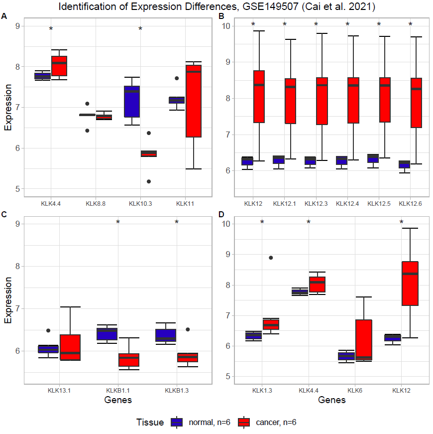

\thispagestyle{empty}
\hrule
\vspace{0.3cm}
\begin{center}
	\vspace{1cm}
  \large
	\begin{tabular}[c]{l}
	 \\

Anouk Dupe, David Eckey, Dustin Schilling, Maria Yemane \\
\\
	 \\
	Supervisor:
	Dr. Maria Dinkelacker \\
	 \\
	Tutor:
	Nils Mechtel \\
	 \\
	 \\
	Data Analysis for students of Molecular Biotechnology \\
	\\
	Heidelberg University 
	\vspace{0.3cm} \\
	\end{tabular}
	\end{center}

---

\pagenumbering{gobble}
\pagebreak
\tableofcontents
\pagebreak
\pagenumbering{arabic}

```{r setup, include=FALSE}
knitr::opts_chunk$set(fig.width=12, fig.height=8)
```

```{r Load Libaries, include=FALSE}
library(affy)
library(vsn)
library(AnnotationDbi)
library(hgu133plus2hsenstcdf)
library(hgu133plus2hsenstprobe)
library(hexbin)
library(ggplot2)
library(pheatmap)
library(dendextend) #install.packages("dendextend")
library(factoextra) #install.packages("factoextra")
library(gtools) #install.packages("gtools")
library(plyr)
library(tidyverse) #install.packages("tidyverse")
library(ggfortify)
library(patchwork)
library(RColorBrewer) #install.packages("RColorBrewer")
#library(dendextend)#install.packages("dendextend")
library(float) #install.packages("float")
library(ggdendro) #install.packages("ggdendro")
library(here)
#set the top level folder with here
here::here()
```


```{r Read CEL Files, include=FALSE}
#creating a list of the CEL file names, for all three data sets
setwd(here("Rawdata/GSE65216 breast cancer TNBC Her2 LumA LumB"))
cels.breast <- list.files(pattern = 'CEL')

setwd(here("Rawdata/GSE149507 lung cancer"))
cels.lung <- list.files(pattern = 'CEL')
```

```{r Affybatch, include=FALSE}
#Breast 
breast <- ReadAffy(filenames = paste(here("Rawdata/GSE65216 breast cancer TNBC Her2 LumA LumB"), cels.breast, sep = "/"), verbose = TRUE)
breast@cdfName <- "HGU133Plus2_Hs_ENST"

orig.breast=colnames(exprs(breast))
new.breast <- substr(orig.breast, 1, nchar(cels.breast)-4)
colnames(exprs(breast)) <- new.breast
rownames(breast@phenoData) <- new.breast
rownames(breast@protocolData) <- new.breast

#Lung
lung <- ReadAffy(filenames = paste(here("Rawdata/GSE149507 lung cancer"), cels.lung, sep = "/"), verbose = TRUE)
lung@cdfName <- "HGU133Plus2_Hs_ENST"

orig.lung=colnames(exprs(lung))
new.lung <- substr(orig.lung, 1, nchar(cels.lung)-4)
colnames(exprs(lung)) <- new.lung
rownames(lung@phenoData) <- new.lung
rownames(lung@protocolData) <- new.lung

```

```{r Load in Data, include=FALSE}
breast.vsnrma <- vsnrma(breast)
breastExprs = exprs(breast.vsnrma)

lung.vsnrma <- vsnrma(lung)
lungExprs = exprs(lung.vsnrma)
```


```{r Read ensembl, include=FALSE}

setwd(here("Tables"))

ensembl_df = read.csv("ensembl.103.txt",sep="\t")
```

```{r Dataset breast cancer, include=FALSE}
breastExprs <- breastExprs[grepl("ENST", rownames(breastExprs)), ]
dim(breastExprs) #  95659    20

# remove .x_at suffix
rownames(breastExprs) <- unlist(lapply(strsplit(rownames(breastExprs), split = "\\."), "[", 1))

setwd(here("Scripts"))

#Setting up annotation
transcriptIDs <- as.character(ensembl_df[, "Transcript.stable.ID"])
geneSymbol <- as.character(ensembl_df[, "HGNC.symbol"])
names(geneSymbol) <- transcriptIDs

# replace ensemble IDs with HGNC symbol
chipIDs.breast <- rownames(breastExprs)
noMatchIDs.breast <- chipIDs.breast[!chipIDs.breast %in% transcriptIDs]
# transcript IDs that are not in ensemble_103.txt
length(noMatchIDs.breast) #112

newChipIDs.breast <- chipIDs.breast[chipIDs.breast %in% transcriptIDs]
breastExprs <- breastExprs[newChipIDs.breast, ]
dim(breastExprs) ## 95547    10

symbol <- geneSymbol[newChipIDs.breast]
symbol.breast <- geneSymbol[newChipIDs.breast]
rownames(breastExprs) <- make.names(as.character(symbol.breast), unique = TRUE)  # Matrix to work with

head(breastExprs)
```

```{r Dataset lung cancer, include=FALSE}
lungExprs <- lungExprs[grepl("ENST", rownames(lungExprs)), ]
dim(lungExprs) #  95659    20
 
# remove .x_at suffix
rownames(lungExprs) <- unlist(lapply(strsplit(rownames(lungExprs), split = "\\."), "[", 1))

setwd(here("Scripts"))

# replace ensemble IDs with HGNC symbol
chipIDs.lung <- rownames(lungExprs)
noMatchIDs.lung <- chipIDs.lung[!chipIDs.lung %in% transcriptIDs]
# transcript IDs that are not in ensemble_103.txt
length(noMatchIDs.lung) #112

newChipIDs.lung <- chipIDs.lung[chipIDs.lung %in% transcriptIDs]
lungExprs <- lungExprs[newChipIDs.lung, ]
dim(lungExprs) ## 95547    10


# 
symbol.lung <- geneSymbol[newChipIDs.lung]
rownames(lungExprs) <- make.names(as.character(symbol.lung), unique = TRUE)  # Matrix to work with

head(lungExprs)

```


## 1. Introduction

KLKs are a family of 15 mammalian secreted serine proteases. Analysis has shown that the KLK locus is most likely located on chromosome 19 and forms the largest cluster of contiguous proteases in the entire genome. (Yousef et al. 2000).  
All 15 kallikrein genes are proteolytic enzymes of steroid hormone regulation and are involved in the regulation of blood pressure, tissue remodeling, skin desquamation, and many other processes. The structure of KLK are similar with two beta-drums, two alpha-helices and a distinct loop involved in the regulation of activity and selectivity. Currently, the specific role of each kallikrein is unclear. It is known that they are involved in the complex regulatory processes, more specifically in those different signaling cascades.  
Dysregulation of KLKs are frequently associated with cancer. Their expression in different tissues and their involvement in different physiological processes make them potential tumor expression markers (Fischer and Meyer-Hoffert, 2013).  
Differential expression of different kallikrein genes has been found in different cancer types. While clear cell and papillary renal carcinomas have similar kallikrein expression profiles, chromophobe renal cell carcinoma has a unique expression profile (Tailor et al. 2018).

In the following, a set of in total 32 microarrays will be analysed. 20 of those originate from patients with breast cancer derived from the data set GSE65216 (Maire et al. 2013), 12 from patients with small cell lung cancer from GSE149507 (Cai et al. 2021). In this report, both cancer types are analyzed seperatively and both their results will be discussed later on.


## 2. Quality control

After reading in the data, the first step is to verify its quality by following the steps presented in "R Course Micoarray Analysis" by Dr. Maria Dinkelacker (2019). The goal of quality control is to identify samples for which the data characteristics are significantly different. These differences would be difficult to remove via variance stabilizing normalisation (vsn) and could interfere with the rest of the data. Samples that show odd characteristics will thereby be identified and replaced in the following quality control. The quality control is performed on the breast cancer microarray data set GSE65216 (Maire et al. 2013) and the small cell lung cancer microarray data set GSE149507 (Cai et al. 2021).


### 2.1 Quality control - GSE65216 breast cancer

Upon examination of each individual array, there are no scratches or lighter areas detectable, which means the arrays themselves are fine. Furthermore, the meanSd plot is being used to verify the variance stabilization. Here, the red line, which stands for the running median, should be horizontal. However for the breast cancer data, it follows a linear relationship.   
```{r echo=FALSE, fig.align="center", fig.cap="meanSD plot of breast cancer microarray GSE65216.", out.width="50%"}


```
In contrast to that, the quality of the breast cancer data is assured by the other plots, which is the reason why our group did not choose other chips for the data analysis. For the boxplots, it is clearly visible, that the differences in intensities between arrays is strongly reduced after normalisation. The boxplots only show little fluctuation in gene expression for the 20 arrays after normalisation. In addition to that, none of the current chips deviate strongly from each other for the density and RNA degradation plot (before and after normalisation). Also, the scatter plots show linear relationships between each chip. The quality control plots can be seen in the github repository.

### 2.2 Quality control - GSE149507 lung cancer
For the small cell lung cancer microarray, an abnormality was dectable in the scatter plots. The carcinoma tissue sample of patient number 5 did not show linear relationship to all of the other samples. Since the samples of dataset GSE149507 for normal and carcinoma tissue are linked to one patient each, we consequently replaced the two chips GSM4504109_SCLC_05_ca and GSM4504110_SCLC_05_n with new 2 new chips out of the gene expression omnibus. When performing the scatter plot control over again, there are no discrepancies.  
```{r Broken chip - lung qc, echo=FALSE, fig.align="center", fig.cap="Example of scatter plot breast cancer GSE65216.", out.width="50%"}
knitr::include_graphics("images/breast_scatter_example1.png")
```
Equivalent to the breast cancer microarray, there were no further abnormalities detectable for the lung cancer microarray.


## 3. TRA data
```{r Import TRA data, include=FALSE}
setwd(here("TRA Daten"))


# Import of tra.human.5median
tra.human.5median=read.csv(file="Human_protein_atlas_TRA_5median_genes_annotated.tsv", sep=",")

# Import of tra.human
tra.human=read.csv(file="tra.2014.human.5x.table.tsv", sep="\t")

# Import of tra.human.roth
tra.human.roth=read.csv(file="tra.2014.human.roth.5x.table.tsv", sep="\t")

# Import of tra.mouse.4301
tra.mouse.4301=read.csv(file="tra.2014.mouse.4301.5x.table.tsv", sep="\t")

# Import of tra.human.gtex
tra.human.gtex=read.csv(file="tra.2017.human.gtex.5x.table.tsv", sep="\t")

#Import of tra.mouse 
tra.mouse=read.csv(file="tra.2014.mouse.5x.table.tsv",sep="\t")

```

```{r Union of TRA data, include=FALSE}
### Filter all Klk from the TRA data sets

# For tra.human  
ind.human=grepl("^KLK",tra.human$gene.symbol)
ind.human =which(ind.human == TRUE)
Klk.TRA1 = as.data.frame(tra.human[ind.human,])

# For tra.human.5median
ind.5median=grepl("^KLK",tra.human.5median$Symbol)
ind.5median =which(ind.5median == TRUE)
Klk.TRA2 = as.data.frame(tra.human.5median[ind.5median,])

# For tra.human.roth
ind.roth=grepl("^KLK",tra.human.roth$gene.symbol)
ind.roth =which(ind.roth == TRUE)
Klk.TRA3 = as.data.frame(tra.human.roth[ind.roth,])

# For tra.mouse
ind.mouse=grepl("^Klk",tra.mouse$gene.symbol)
ind.mouse =which(ind.mouse == TRUE)
Klk.TRA4 = as.data.frame(tra.mouse[ind.mouse,])

# For tra.mouse.4301
ind.4301=grepl("^Klk",tra.mouse.4301$gene.symbol)
ind.4301 =which(ind.4301 == TRUE)
Klk.TRA5 = as.data.frame(tra.mouse.4301[ind.4301,])

# For tra.human.gtex 
ind.gtex=grepl("^KLK",tra.human.gtex$ensembl.symbol)
ind.gtex=which(ind.gtex == TRUE)
Klk.TRA6=as.data.frame(tra.human.gtex[ind.gtex,])


### Creating a unified TRA data set, that only contains important information for our overview
nrow.x = nrow(Klk.TRA1) + nrow(Klk.TRA2) + nrow(Klk.TRA3) +nrow(Klk.TRA4)+ nrow(Klk.TRA5) + nrow(Klk.TRA6)
Union.TRA = as.data.frame(matrix(ncol = 6, nrow=nrow.x))
union.names <- c("ensembl_transcript","ensembl_genes", "Chromosome", "gene.symbol", "max.tissue", "dataset") ## assigning the unified columns
colnames(Union.TRA) <- union.names 
## now assign the rows, we poorly need to do this manually since there is no strict order of the columns of the 5 TRA data sets
## Watch out!! Chromosomes on the mice are not comparable to humans!!!
Union.TRA[1:nrow(Klk.TRA1),c(1:5)] <- Klk.TRA1[,c(1,2, 7, 3, 11)] # For Klk.TRA1
Union.TRA[nrow(Klk.TRA1)+1:nrow(Klk.TRA2),c(2:5)] <- Klk.TRA2[,c(1, 2, 6, 11)] # For Klk.TRA2
Union.TRA[nrow(Klk.TRA1)+nrow(Klk.TRA2)+1:nrow(Klk.TRA3),c(1:5)] <- Klk.TRA3[,c(1,2, 7, 3, 11)] # For Klk.TRA3
Union.TRA[nrow(Klk.TRA1)+nrow(Klk.TRA2)+nrow(Klk.TRA3)+1:nrow(Klk.TRA4),c(1:5)] <- Klk.TRA4[,c(1,2, 7, 3, 11)] # For Klk.TRA4
Union.TRA[nrow(Klk.TRA1)+nrow(Klk.TRA2)+nrow(Klk.TRA3)+nrow(Klk.TRA4)+1:nrow(Klk.TRA5),c(1:5)] <- Klk.TRA5[,c(1,2, 7, 3, 11)] # For Klk.TRA5
Union.TRA[nrow(Klk.TRA1)+nrow(Klk.TRA2)+nrow(Klk.TRA3)+nrow(Klk.TRA4)+nrow(Klk.TRA5)+1:nrow(Klk.TRA6),c(1:5)] <- Klk.TRA6[,c(1,2,6,3, 10)] # For Klk.TRA6

## now annotate the the data set
#->> VERY HELPFUL for later plots -> e.g. selecting rows that only apply for the human KLKs: 
#(Union.TRA$dataset == "tra.human")!!!!
Union.TRA[1:nrow(Klk.TRA1), 6] <- "tra.human"
Union.TRA[nrow(Klk.TRA1)+1:nrow(Klk.TRA2),6] <- "tra.human.5median"
Union.TRA[nrow(Klk.TRA1)+nrow(Klk.TRA2)+1:nrow(Klk.TRA3),6] <- "tra.human.roth"
Union.TRA[nrow(Klk.TRA1)+nrow(Klk.TRA2)+nrow(Klk.TRA3)+1:nrow(Klk.TRA4),6] <- "tra.mouse"
Union.TRA[nrow(Klk.TRA1)+nrow(Klk.TRA2)+nrow(Klk.TRA3)+nrow(Klk.TRA4)+1:nrow(Klk.TRA5),6] <- "tra.mouse.4301"
Union.TRA[nrow(Klk.TRA1)+nrow(Klk.TRA2)+nrow(Klk.TRA3)+nrow(Klk.TRA4)+nrow(Klk.TRA5)+1:nrow(Klk.TRA6),6] <- "tra.human.gtex"

# Remove identical entries 
new.union <- rownames(unique(Union.TRA[1:4]))
Union.TRA <- Union.TRA[new.union,] 

### all human KLK genes across all TRA data sets

ind.all.tra.human.KLK <- grep("^tra.human", Union.TRA$dataset)
tra.all.human <- Union.TRA[ind.all.tra.human.KLK,]


# all unique human KLK names that are present as TRAs
all.human.KLK.gene.symbols <- unique(Union.TRA$gene.symbol[grep("tra.human", Union.TRA$dataset)])
all.human.KLK.gene.symbols # These are all the available KLK TRAs we can possibly work with
```

```{r TRA -piechart, echo=FALSE, fig.align="center", fig.cap="Tissue specificy of KLK genes - KLK genes from six TRA datasets are combined and sorted for tissue specificity", out.width="50%"}

knitr::include_graphics("images/piechart_TRA.png")
```
To distinguish between TRA KLK genes and non-TRA KLK genes, a total of 6 TRA data sets were utilized ((Su et al. 2002, 2004), (Roth et al. 2008), (Lattin et al. 2006), (human GTEX data 2015), (Uhlén et al. 2015)). These TRA data sets were than unified, which allowed the extraction of tissue-restricted KLKs after their transcription number.  
To get an overview of the distribution of the Tissue Restricted Antigens, especially those that are Kallikrein genes, a pie chart was conducted.
A pie chart in general allows a quick overview and a first assessment of numerical distribution values. In this pie chart, the distribution of Tissue Restricted Kallikrein-Antigens is displayed. Notable is the high prevalence of prostatic kallikrein genes, as well as an occurrence in esophagus, thyroid and salivary gland. 
Since six data sets were combined, annotations for the same tissue were different, which were fused manually.


## 4. Expression Analysis
```{r Isolating KLK genes, include=FALSE}
# All KLK genes
ind.all.KLK=grep("^KLK",symbol)
Kallikreins.all=symbol[ind.all.KLK]

ind.all.human =which(as.character(symbol) %in% as.character(Kallikreins.all)) 
Kallikreins<- as.character(Kallikreins.all)
Kallikreins

## For breast GSE
all.KLK.breast = breastExprs[ind.all.human,]

## For lung GSE 
all.KLK.lung = lungExprs[ind.all.human,]


ind.KLK.all.human.tra <- which(as.character(names(symbol))  %in% 
as.character(unlist(tra.all.human[1])))

## For breast GSE
TRA.KLK.breast = breastExprs[ind.KLK.all.human.tra,]

## For lung GSE 
TRA.KLK.lung = lungExprs[ind.KLK.all.human.tra,]
```

## 4.1 Breast cancer GSE65216 (Maire et al. 2013)
The breast cancer microarray data GSE65216 (Maire et al. 2013) consists of 20 samples. The samples are all breast cancer tissue, differentiated by the four mutation types: Triple negative breast cancer (TNBC), Her2, Luminal A and Luminal B. 

### Clean up identical isoforms
Having a look onto the data set itself, it is noticeable, that some of the expression values of the KLK isoforms in the microarray are exactly identical. These identical isoforms should be cleared out to increase the real information value of the KLKs. This is easily done by conducting pairwise correlations, here the pearson correlation, between all KLK genes in a diagonal matrix. If the correlation yields a value of 1 then the two gene isoforms are the same and the latter one of both will be removed. Furthermore, the KLKs are sorted after their names in ascending order for the later visualization. In the end, 39 identical isoforms are removed, whereas a total of 73 KLK transcripts for the 15 KLK genes are being kept. Out of the 73 isoforms, 63 are TRAs, while only 10 are regarded as tissue restricted.
```{r cleanup identical transcripts - breast cancer}
# transform dataset - genes on columns
df.TRA.KLK.breast <- data.frame(t(TRA.KLK.breast))

# Define function for calculating correlation 
cor.genes <- function(df){
  df.cor <- cor(df, method = "pearson")
  diag(df.cor)=NA
  df.cor[upper.tri(df.cor)]=NA
  return(data.frame(df.cor))
}

# amount of identical columns
cor.TRA.KLK.breast <- cor.genes(df.TRA.KLK.breast)
length(which(cor.TRA.KLK.breast == 1))

# cleanup function 
genes.cleanup <- function(df){
  df[!duplicated(unclass(df))]
}

# remove identical columns
TRA.KLK.breast.clean <- genes.cleanup(df.TRA.KLK.breast)
dim(TRA.KLK.breast.clean)
```


```{r order transcripts - breast cancer, include=FALSE}
# check clean dataframe for correlations
length(which(cor.genes(TRA.KLK.breast.clean)==1)) #0 correlations

# First we need to clean up the isoforms again
df.all.KLK.breast <- data.frame(t(all.KLK.breast))

# Apply on all KLK data set
cor.all.KLK.breast <- cor.genes(df.all.KLK.breast)
length(which(cor.all.KLK.breast == 1))
#Identical transcripts can cause issues later on for statistical testing etc. 

# remove identical isoforms
all.KLK.breast.clean <- df.all.KLK.breast[!duplicated(unclass(df.all.KLK.breast))]
dim(all.KLK.breast.clean) #removed 39 identical isoforms

# Use mixedsort function from the gtool package to sort the KLKs correctly
order.breast <- mixedsort(colnames(all.KLK.breast.clean))
order.breast <- order.breast[c(1:3,11:17,4:10,18,19,24:27,20:23,28:73)]
all.KLK.breast.clean <- t(all.KLK.breast.clean[,order.breast]) #sorted all.KLK.breast.clean
all.KLK.breast.clean <- data.frame(all.KLK.breast.clean)
# correct some of the ordering
order.breast1 <- mixedsort(colnames(TRA.KLK.breast.clean))
order.breast1 <- order.breast1[c(1:3,11:17,4:10,18,19,23:26,20:22,27:63)]
TRA.KLK.breast.clean <- t(TRA.KLK.breast.clean[,order.breast1])
TRA.KLK.breast.clean <- data.frame(TRA.KLK.breast.clean)
```

### Overview gene expression
Since the data is vsnrma normalized, the median does not fluctuate too much for all samples. The lowest gene expression value of the first chip is roughly 6 while the highest gene expression value is around 16. Due to the logarithmic scale with a base of 2, gene expression is double as high between two samples if the log-fold change is +1.
```{r Overview and Histogram breast cancer}
gene.summary <- function(x){
 round(apply(x, 2, summary), digits = 2)
}
gene.summary(breastExprs)[,1]
```
The histogram represent the frequency of the present gene expression in breast cancer samples. It also shows, that the median gene expression of KLKs is much lower than the overall median gene expression. This means that most of the KLK gene expression is normally down-regulated in the perspective of the whole genome. (Yousef et al. 2004)
```{r Histogram - breast , echo=FALSE, fig.align="center", fig.cap="Histogram of breast cancer gene expression.", out.width="50%"}
knitr::include_graphics("images/Histogram_breast.png")
```


### Boxplots
```{r Boxplot - breast , echo=FALSE, fig.align="center", fig.cap="Boxplot of KLK gene expression in breast cancer.", out.width="50%"}
knitr::include_graphics("images/Boxplot_breast.png")
```
Here, the pattern for the fairly low gene expression of KLKs is also recognizable. Most of the boxplots of the single KLK gene isoforms are lower than the median expression of the whole breast cancer genome. Some KLK isoforms like KLK2.3 are even below a gene expression value of 6, so KLK isoforms like these are clearly down-regulated. This is compatible with the finding of Yousef et al. in which they state an overall down-regulation of KLK gene expression in breast cancer. There are only two isoforms that exceed the median of the whole genome expression of the breast cancer set. These are the isoforms KLK4.4 and KLK8.8.  
KLK4 gene expression was found by Schmitt et al. to be up-regulated in breast cancer tissue as in comparison to healthy breast tissue. This seems to correspond with the finding shown in the boxplot, but only for the KLK4.4 isoform. Thereby, KLK4.4 needs to be looked on more carefully. In contrast to that, KLK8 seems to be higher expressed in both normal and cancer tissue.(Schmitt et al. 2013)


### Heatmap
The dendrogram is the core for the emerging clustering in heatmaps. 
```{r Dendrogram - breast , echo=FALSE, fig.align="center", fig.cap="Dendrogram of KLK genes in breast cancer. Clustering is performed after the complete-linkage method. The genes are separated into 3 clusters.", out.width="50%"}
knitr::include_graphics("images/Dendrogram_breast.png")
```
Interesting in this respect is, that KLK4.4 forms its own branch independent of all the others. As already shown in the boxplots, KLK4.4 was distinctly up-regulated. Looking onto the other branches of the dendrogram, it is notable that besides KLK4.4 there are more possible clusters. To increase the clarity of the heatmap, KLKs are separated into 3 clusters. Optimal clustering via K-means will still be performed later on.  
```{r Heatmap - breast , echo=FALSE, fig.align="center", fig.cap="Heatmap of KLK gene expression in breast cancer. The samples are annotated corresponding to their mutation type. Additionally, the KLKs are differentiated by their cluster and potential tissue restriction.", out.width="50%"}
knitr::include_graphics("images/Heatmap_breast.png")
```
KLK4.4 clearly stands out (cluster 2) with an overall up-regulated gene expression across all sample. Furthermore, as it is annotated KLK4.4 belongs to the TRA group. Moreover, gene expression in cluster 1 is higher than in the third cluster. There are only few samples which seem to have up-regulated KLK isoforms. For instance, the tumor sample number 1 and 6 (Tum01_TNBC and Tum01´6_TNBC) got one of the highest expression values across all the KLKs for KLK10.3, KLK6 and KLK5. As well as the tumor sample number 71 and 76 (Tum71_LumA, Tum76_LumA) for the transcripts KLK11 and KLK11.2.

### PCA
The principal component analysis was conducted over the samples. Centering was enabled, while scaling was not included, due to the data being vsnrma normalized. The cumulative variance of the first two principal components (PCs) yield 72% of the total variance. Thereby, these two PCs explain 72% of the total information value. PC1 and PC2 are sufficient for the analysis. The breast cancer samples are distributed after their respective loadings of KLK gene expression.  
```{r PCA plot - breast , echo=FALSE, fig.align="center", fig.cap="PC1 (46,49%) is plotted against PC2 (25,39%). The upper part shows the distribution of the breast cancer samples annotated by their mutation type, while the lower part depicts the 12 highest loadings of the KLK genes.", out.width="50%"}
knitr::include_graphics("images/PCAplot_breast.png")
```
The loadings consists of the the top 12 most differentiated KLK isoforms. This was conducted by adding the absolute values of the rotation matrix for each individual KLK isoform. As the PCA displays, some samples are more characterized by the expression of KLK11 and KLK11.2. This is mostly the case for two of the LumA samples. This was also observable in the heatmap by the higher expression of KLK11 and KLK11.2 for the tumor samples 71 and 76. Another finding of the PCA is that TNBC mutations are affected by KLK5 and KLK6 expression, also observable in the heatmap. Presumably KLK4.4 is not part of the top 12 loadings, since it is higher expressed across all tumor samples.  

### K-means clustering
K-means was performed to be able to draw conclusions on characteristics and the distribution of different Kallikrein genes. Here, the optimal number k of clusters was determined in doing a Within Cluster Sum of Squares – plot, also called the elbow method. A kink in the curve of a plot, in which the number k of clusters is plotted against the within cluster sum of squares, displays the optimal number of k clusters. Rising numbers of k will not cause a significant decline in the within cluster sum of squares anymore. 
For the breast cancer GSE65216 data set, the Within Cluster Sum of Squares – plot predicted an optimal number of k = 6, so k-means was performed using 6 clusters. The function of k-means automatically reduces dimensions to 2 if a dataset consists of 3 or more dimensions, so the k-means clustering does not directly cluster genes of interest according to their expression values, but cluster according to two dimensions that are influenced by expression values, as those explain most of the variance of the data. Due to this influence, k-means is still suited for clustering and thus comparing KLK expression patterns. Outstanding cluster is here marked as cluster 1 in green, containing KLKs4.4 and KLK8.8. Those genes already stood out in the heatmap analysis. Interestingly, cluster 4 is also very distinct but on the very other direction on the graph of two dimensions.


```{r K-means plot - breast , echo=FALSE, fig.align="center", fig.cap="K-means cluster analysis with k = 6 clusters for the breast cancer data set", out.width="50%"}

knitr::include_graphics("images/kmeans_6_breast.png")

```

``` {r k-means for breast cancer dataset, eval=FALSE, include=FALSE}


wssplot.breast <- function(breastExprs, nc=15, seed=1234)
{
  wss <- (nrow(breastExprs)-1)*sum(apply(breastExprs,2,var))
  for(i in 2:nc){
    set.seed(seed)
    wss[i] <- sum(kmeans(breastExprs, centers = i)$withinss)}
  plot(1:nc, wss, type="b", xlab="Number of Clusters", ylab="Within groups sum of squares")
}
  

wssplot.breast(breastExprs)


km.breast <- kmeans(scale(breastExprs),3, nstart=25)
km.breast$cluster

fviz_cluster(km.breast, data=breastExprs, 
             palette =c("#2E9FDF","#00AFBB", "#FC4E07"), 
             geom = "point", 
             ellipse.type = "convex",
             ggtheme = theme_bw()
)


#k-means analysis fpr klks from breastcancer
#(all.KLK.breast.clean.noGSM)

tf.klk.breast.clean = t(all.KLK.breast.clean.noGSM)
setwd(here("Plots/Plots_breast"))
pdf("wssplot_breast.pdf")
wssplot.klk.breast <- function(tf.klk.breast.clean, nc=15, seed=1234)
{
  wss <- (nrow(tf.klk.breast.clean)-1)*sum(apply(tf.klk.breast.clean ,2,var))
  for(i in 2:nc){
    set.seed(seed)
    wss[i] <- sum(kmeans(tf.klk.breast.clean , centers = i)$withinss)}
  plot(1:nc, wss, type="b", xlab="Number of Clusters", ylab="Within groups sum of squares")
}

wssplot.klk.breast(tf.klk.breast.clean)

dev.off()

setwd(here("Plots/Plots_breast"))
pdf("kmeans6_breast.pdf")
km.klk.breast <- kmeans(scale(tf.klk.breast.clean),6, nstart=25)
km.klk.breast$cluster

fviz_cluster(km.klk.breast, data=tf.klk.breast.clean, 
             palette =c("#009900","#00AFBB", "#FC4E07", "#E7B800", "#003333","#FF66CC"), 
             geom = c("point","text"), 
             ellipse.type = "convex",
             ggtheme = theme_bw(),
             labelsize = 5,
             repel=TRUE,
             main="K-Means-Clustering, GSE65216 (Maire et al.2013)"
)
dev.off()

```


### Hypothesis testing
WILCOX TEST WEITER AUSFÜHREN?! DATENSTRUKTUR ERKLÄREN?!

The expression values of the Kallikrein genes obtained from Marie et al. were not normally distributed. Therefore the non- parametric Wilcoxon-Mann-Whitney-Test was used. 

(First, cluster 1 (KLK4.4 and KLK8.8) were tested for overexpression against all other KLKs individually from the dataset. KLK4.4 (TRA) was significantly higher expressed than all other KLK genes from the dataset. Likewise, KLK8.8 (non-TRA) was significantly higher expressed than all KLK genes, except KLK4.4. Those results conform with the observations from the heatmap and the k-means clustering. 
Cluster-4 (KLK5,5.3,6,10.3) was isolated in the k-means clustering. On the heatmap it was conspicuous that for some tumor types the genes of this cluster were higher expressed. Thus the upper-tail Wilcoxon-test was used. In contrast to Cluster-1, Cluster-4 could not be clearly identified as an overexpression cluster. KLK5.3 and KLK6 were higher expressed than two thirds of the other KLK genes, wereas KLK5,10.3 were not significantly higher expressed than most of the other KLKs.)

The main characteristic of the dataset from Marie et al. is the subdivision into the samples with different mutations (Her2, LumA, LumB, TNBC). In the heatmap four genes were identified, which were overexpressed in at least two of the five mutation specific mikrochips. KLK10.3,6 for Her2, KLK11,11.2 for LumA. Those four genes are also identified as one of the twelve main loadings of the PCA.

```{r, Hypothesis test panel plot with significant bars, echo=FALSE, fig.align="center", fig.cap="Panel plot of the PCA loading genes with significant bars. *: p-value <= 0.5, **: p-value <= 0.01 ", out.width="50%"}
knitr::include_graphics("images/breast_panel_loadings_test.png")

```
In Figure X, these genes are shown with the subdivision into the different mutation types. Significant expression differences between mutation samples are indicated with brackets.

In a previous study (Haritos et al. 2018) KLK6 expression was found to be generally downregulated in breast cancer tissue, but in HER2 and TNBC positive tumors KLK6 was overexpressed. Those findings are only reflected to a limited extend in this analysis. Only Her2 was found to be significantly higher expressed than LumA. TNBC was not significantly higher expressed compared to the other mutations. 

Another study from Michaelidou et al. reported a higher expression of KLK8 in TNBC and Her2 positive tumors compared to LumA and LumB positive tumors. However, this analysis could only confirm significant TNBC overexpression for the isoform KLK8.5 compared to LumA and LumB. Nevertheless, the boxplots of KLK8.4 and KLK8.5 show the trend of Her2 and TNBC overexpression. 

In contrast, a recurring pattern in figure X is the significant overexpression of TNBC in comparison to Her2. This observation includes KLK5, KLK5.3, KLK10, KLK10.3. 

In summary, the conducted analysis could partially conform the findings from other research groups. The differences can probably be explained by the small amount of samples used in this analysis. In conclusion Kallikrein gene expression can be used for identifying tumor subtypes and even predict the outcome for a patient (Haritos et al. 2018). 


## 4.2 Lung cancer GSE149507 (Cai et al. 2021)
The lung cancer microarray GSE149507 (Cai et al. 2021) derives from six patients with small cell lung cancer. The data set consists of a total of 12 samples. Carcinoma tissue and healthy lung tissue, which is adjacent to the carcinoma, make up 6 samples each.  

### Overview gene expression
```{r Histogram - lung , echo=FALSE, fig.align="center", fig.cap="Histogram of lung cancer gene expression.", out.width="50%"}
knitr::include_graphics("images/Histogram_lung.png")
```
Just as for the breast cancer data set, the median expression of the KLKs is beneath the the median of the overall gene expression, since KLKs are mostly down-regulated (Yousef et al. 2004). However for the lung cancer data set, it appears that the gene expression values are distributed more evenly, while the breast cancer histogram represents a right-skewed distribution.  

### Boxplots
```{r Boxplot - lung , echo=FALSE, fig.align="center", fig.cap="Boxplot of KLK gene expression in lung cancer.", out.width="50%"}
knitr::include_graphics("images/Boxplot_lung.png")
```
Most of the KLK boxplots seem to be lower than the overall median gene expression and thereby are clearly down-regulated. Interestingly, KLK4.4 clearly stands out again as the highest expressed KLK gene. However, it needs to be considered that the expression of KLK4.4 is around the value 8, which does not really correspond with an over-expression in the context of the whole genome. Another interesting observation is that the boxplots of the KLK11 and KLK12 transcripts are big. With the whiskers of the boxplots, the gene expression spreads from a value of around 6 to about 9.5. This correlates with a high variety in gene expression for these gene transcripts. KLK11 and KLK12 gene expression therefore has a high information value that should be recognizable in the following methods. This could also be due to the fact that the lung cancer data set consists of of both normal and healthy tissue, as in comparison to the breast cancer data set. Here, KLK11 and KLK12 are clear subject for further investigation in whether they are differently expressed between normal and carcinoma samples.    

### Heatmap
```{r Dendrogram - lung , echo=FALSE, fig.align="center", fig.cap="Dendrogram of KLK genes in lung cancer. Clustering is performed after the complete-linkage method. The genes are separated into 3 clusters.", out.width="50%"}
knitr::include_graphics("images/Dendrogram_lung.png")
```
The same strategy as for the breast cancer data set is applied to improve the quality of the heatmap. The dendrogram shows that multiple KLK11 and KLK12 isoforms, as well as KLK4.4 are part of one out of the three clusters.
```{r Heatmap - lung , echo=FALSE, fig.align="center", fig.cap="Heatmap of KLK gene expression in breast cancer. Carcinoma and normal samples are annotated. Additionally, the KLKs are differentiated by their cluster and potential tissue restriction.", out.width="50%"}
knitr::include_graphics("images/Heatmap_lung.png")
```
Notably, the samples are clustered according to their tissue type being lung carcinoma or healthy tissue. As you can see in the dendrogram at the top, the normal samples are clustered into one group with additionally two more cancer samples. The other four cancer samples all form their own distinct group. This distribution by sample type clearly reflects itself in the KLK11 and KLK12 gene expression. While KLK4.4 is higher expressed for both normal and carcinoma samples, KLK11 and KLK12 isoforms are mainly higher expressed for the carcinoma sample. The only exception are the already mentioned carcinoma samples SCLC_01 and SCLC_03. Apart from this, the up-regulated gene expression for KLK11 and KLK12 are accompanied by the sample deriving from carcinoma tissue.  
As stated by Borgoño et Diamandis, KLK11 up-regulation in lung cancer was found to have a unfavourable prognosis for the patient. A total of four out of the six cancer samples have slightly up-regulated KLK11 values. The significance will be tested. The two aforementioned carcinoma samples SCLC_01 and SCLC_03 even got down-regulated KLK11 expression, which thereby might indicate a good chance of treatment success. (Borgoño et Diamandis 2004)

### PCA
```{r PCA plot - lung , echo=FALSE, fig.align="center", fig.cap="PC1 (73,40%) is plotted against PC2 (10,54%). The upper part shows the distribution of the lung cancer samples annotated by their tissue type, while the lower part depicts the top 7 loadings of the KLKs.", out.width="50%"}
knitr::include_graphics("images/PCAplot_lung.png")
```
The cumulative variance shows, that 84% of the total variance is explained by the first two PCs. These two PCs are more than sufficient for the analysis. However the first two PCs covering such a huge proportion of the whole variance corresponds with an overall low information value of the lung cancer data set. Considering the heatmap, in which most of expression values were down-regulated, there is only a low amount of differential gene expression going on. This explains the high cumulative variance. 
Nevertheless, the PCA still shows a clear separation between normal and carcinoma samples.  Considering the loadings, four of the cancer samples are characterized by KLK12, while the other two tumor samples SCLC_01_ca and SCLC_03_ca are mainly represented by KLK4.4 and KLK6 expression. Just as shown in the heatmap, while four out of the six cancer samples have up-regulated KLK12 expression values, the two cancer samples SCLC_01_ca and SCLC_03_ca form an exception. These two do not go along with the KLK12 loading and are rather defined by KLK6 and KLK4.4 expression.


### Clustering - kmeans
K-means performed for the lung cancer GSE149507 dataset showed an interesting and distinct cluster, which only consisted of KLK-subtypes of KLK12. Other genes that stood out in the heatmap analysis, for example KLK4.4 and KLK8.8, were found in the first cluster on the top left corner. The finding of optimal k clusters happened following the same procedure as for the breast cancer data set, described above. An optimal number of k = 5 clusters was determined using a Within Cluster Sum of Squares – plot.
```{r K-means plot - lung , echo=FALSE, fig.align="center", fig.cap="K-means cluster analysis with k = 5 clusters for the lung cancer data set", out.width="50%"}


```


``` {r k-means for lung cancer dataset, eval=FALSE, include=FALSE}


wssplot.lung <- function(lungExprs, nc=15, seed=1234)
{
  wss <- (nrow(lungExprs)-1)*sum(apply(lungExprs,2,var))
  for(i in 2:nc){
    set.seed(seed)
    wss[i] <- sum(kmeans(lungExprs, centers = i)$withinss)}
  plot(1:nc, wss, type="b", xlab="Number of Clusters", ylab="Within groups sum of squares")
}
  

wssplot.lung(lungExprs)


## bekomme code nicht zum laufen, Anmerkung für später: Anzahl cluster determinieren!!!
#code für cluster lungexprs
km.lung <- kmeans(scale(lungExprs),4, nstart=25)
km.lung$cluster

fviz_cluster(km.lung, data=lungExprs, 
             palette =c("#2E9FDF","#00AFBB", "#FC4E07", "#E7B800"), 
             geom = "point",
             ellipse.type = "convex",
             ggtheme = theme_bw()
)

#k-means analysis fpr klks from lungcancer
#(all.KLK.lung.clean.noGSM)
setwd(here("Plots/Plots_lung"))
pdf("wssplot_lung.pdf")
wssplot.klk.lung <- function(all.KLK.lung.clean.noGSM, nc=15, seed=1234)
{
  wss <- (nrow(all.KLK.lung.clean.noGSM)-1)*sum(apply(all.KLK.lung.clean.noGSM ,2,var))
  for(i in 2:nc){
    set.seed(seed)
    wss[i] <- sum(kmeans(all.KLK.lung.clean.noGSM , centers = i)$withinss)}
  plot(1:nc, wss, type="b", xlab="Number of Clusters", ylab="Within groups sum of squares")
}

wssplot.klk.lung(all.KLK.lung.clean.noGSM)

dev.off()

#approx 5 clusters
setwd(here("Plots/Plots_lung"))
pdf("kmeans5_lung.pdf")
km.klk.lung.5 <- kmeans(scale(all.KLK.lung.clean.noGSM),5, nstart=25)
km.klk.lung.5$cluster


fviz_cluster(km.klk.lung.5, data=all.KLK.lung.clean.noGSM, 
             palette =c("#003333","#00AFBB", "#FC4E07", "#FF66CC", "#009900"), 
             geom = c("point","text") ,
             ellipse.type = "convex",
             ggtheme = theme_bw(),
             labelsize = 5,
             repel=TRUE,
             main="K-Means-Clustering, GSE149507 (Cai et al. 2021)"
             )


dev.off()

km.klk.lung.5
which(km.klk.lung.5$cluster == 3)

```

### Hypothesis testing
The results of the PCA and the k-means indicate that for some KLKs the expression differs between the cancerous and normal tissue. Since the Kallikreins gene expression is not normally distributed, the Wilcoxon signed-rank test was used.
In figure X plot A, KLK4.4 was significantly higher expressed in cancer tissue. Unlike, KLK10.3 which was significantly higher expressed in normal tissue. The findings of decreased KLK11 expression in lung cancer from Sasaki et al. could not be confirmed. In fact, the median of the cancer tissue samples is clearly higher. 
Plot B shows that KLK12 and its isoforms are significantly higher expressed in cancer tissue. The plot also visualizes the high similarity within isoforms, as only only identical ones were removed during the clean up. Documented KLK12 overexpression could not be found in the literature, but in functional studies KLK12 was identified as a pro-angiogentic factor (Bonda et al. 2018).  
The genes that pointed towards the normal microchips in the PCA loadings are shown in plot C. There, KLKB1.1 and KLKB1.3 are significantly downregulated in the cancer tissue. 
The only newly tested significant gene, of those that pointed in the direction of the normal microchips visualized in plot D, was KLK1.3. 
In summary five out of seven loadings were found to have a significant expression difference between the tissue types. Those results confirm the clear separation of cancer and normal tissue microchips in the PCA, based on Kallikrein gene expression.  
In conclusion the hypothesis tests confirm the clear separation of cancer and normal tissue microchips in the PCA based on Kallikrein expression. Five out of seven PCA loading genes had an significant expression difference between the tissue types.


```{r , echo=FALSE, fig.align="center", fig.cap="", out.width="50%"}


#Bildunterschrift: Figure X: A) Genes from  k-means cluster 1, B) Genes from k-means cluster 4, C) PCA loading genes oriented in the direction of normal tissue, D) PCA lading genes oriented in the direction of cancer tissue. "*" indicate a p-value > 0.05 between the expression in the different tissue types, upper and lower tail Wilcoxon signed-rank test were used. 
```


## 5. Logistsic regression
Kallikrein mRNA or protein expression is already used in clinical pratice as biomarkers, especially in prostate cancer (Diamandis et al. 1998).
To test whether the identified genes with a significant expression difference were likely to predict tissue type, logistic regression was chosen.
The basic assumtions for logistsic regression are:
1. Independency of errors, every observation has to be  separate from the others.
2. Linearity of the continuous variables in logit - the relationship between the variable and their logit transformed outcome should be linear. 
3. Absence of multicollinearity or redundancy.
4. No outliners with a strong influence. 
5. For every independent variable there should be at least ten outcomes (Jill C.Stoltzfus 2011).

These assumptions reveal the shortcomings of the used data and explain the experienced problems with logistic regression. First, main limitation of the used dataset is the low number of included microchips (only 12, 6 from cancer and 6 from normal tissue). The number of microchips has also been further reduced by splitting the data in a training dataset (8 microchips) and testing dataset (4 microchips).
Therefore, expected problems of high standard errors and large beta-coefficients for the independent variables were  encountered when including more then one independent variable. This phenomenon is also called overfit-model. In fact, even for most individual genes, which had been identified to have an significant expression difference, the described problems were encountered. The only exceptions were KLK4.4 and KLK12. 
Second, although genes with a correlation equal to one were removed, some genes are still highly correlating. This is primarily true for the different isoforms of the same gene, as visualized in figure x, plot B (hypothesis testing KLK12 and isoforms). Therefore, the effect of collinearity would probably cause problems, even if more microchips were included. Hence a second cleanup, removing genes with high correlation (e.g. corr > 0.8), would probably be necessary. 
As mentioned above KLK4.4 and KLK12 (and its isoforms) were the only gene where the standard error of the independent variable was not abnormaly high. But the p-value  was, in both cases, not significant. In contrast, the prediction of these univariant models were surprisingly accurate. The model with KLK4.4 could predict the tissue type of 3 out of 4 microchips correctly, the model with KLK12 even predicted every tissue type right. However, a closer look at the probabilities reveals that these models are anything but reliable. The probabilities for normal to be cancer tissue were mostly over a quarter, indicating a high uncertainty.   
In conclusion, the p-values of the independent variable in the models were not significant, the standard errors were still large and the predictions probabilities were not accurate. These results were not surprising considering the low sample size.


```{r}
#Output of the two models !
```

## Discussion


## References

Ardlie, K.G., Deluca, D.S., Segre, A.V., Sullivan, T.J., Young, T.R., Gelfand, E.T., Trowbridge, C.A., Maller, J.B., Tukiainen, T., Lek, M., et al. (2015). The Genotype-Tissue Expression (GTEx) pilot analysis: Multitissue gene regulation in humans. Science 348, 648-660. 
Borgoño, C.A., and Diamandis, E.P. (2004). The emerging roles of human tissue kallikreins in cancer. Nature Reviews Cancer 4, 876-890. 
Cai, L., Liu, H., Huang, F., Fujimoto, J., Girard, L., Chen, J., Li, Y., Zhang, Y.-A., Deb, D., Stastny, V., et al. (2021). Cell-autonomous immune gene expression is repressed in pulmonary neuroendocrine cells and small cell lung cancer. Communications Biology 4.   
Diamandis, E.P. (1998). Prostate-specific Antigen: Its Usefulness in Clinical Medicine. Trends in Endocrinology & Metabolism 9, 310-316.   
Dinkelacker, M. (2007). A database of genes that are expressed in a tissue-restricted manner to analyse promiscous gene expression in medullary thymic epithelial cells. Diplomarbeit (Albert-Ludwigs-Universitaet).
Dinkelacker, M. (2019). Chromosomal clustering of tissue restricted antigens. Dissertation (University Heidelberg).
Dubey, A.K., Gupta, U., and Jain, S. (2016). Analysis of k-means clustering approach on the breast cancer Wisconsin dataset. International Journal of Computer Assisted Radiology and Surgery 11, 2033-2047. 
Fischer, J., and Meyer-Hoffert, U. (2013). Regulation of kallikrein-related peptidases in the skin – from physiology to diseases to therapeutic options. Thromb Haemost 110, 442-449.
Haritos, C., Michaelidou, K., Mavridis, K., Missitzis, I., Ardavanis, A., Griniatsos, J., and Scorilas, A. (2018). Kallikrein-related peptidase 6 (KLK6) expression differentiates tumor subtypes and predicts clinical outcome in breast cancer patients. Clinical and Experimental Medicine 18, 203-213. 
Kont, V., Laan, M., Kisand, K., Merits, A., Scott, H.S., and Peterson, P. (2008). Modulation of Aire regulates the expression of tissue-restricted antigens. Molecular Immunology 45, 25-33. 10.1016/j.molimm.2007.05.014.
Lattin JE, S.K., Su AI, Walker JR, Zhang J, Wiltshire T, Saijo K, Glass CK, Hume DA, Kellie S, Sweet MJ (2008). Expression analysis of G Protein-Coupled Receptors in mouse macrophages. Immunome Res. 4:5.
Lenga Ma Bonda, W., Iochmann, S., Magnen, M., Courty, Y., and Reverdiau, P. (2018). Kallikrein-related peptidases in lung diseases. Biol Chem 399, 959-971. 
Lonsdale, J., Thomas, J., Salvatore, M., Phillips, R., Lo, E., Shad, S., Hasz, R., Walters, G., Garcia, F., Young, N., et al. (2013). The Genotype-Tissue Expression (GTEx) project. Nature Genetics 45, 580-585. 
Maire, V., Némati, F., Richardson, M., Vincent-Salomon, A., Tesson, B., Rigaill, G., Gravier, E., Marty-Prouvost, B., De Koning, L., Lang, G., et al. (2013). Polo-like Kinase 1: A Potential Therapeutic Option in Combination with Conventional Chemotherapy for the Management of Patients with Triple-Negative Breast Cancer. Cancer Research 73, 813-823. 
Michaelidou, K., Ardavanis, A., and Scorilas, A. (2015). Clinical relevance of the deregulated kallikrein-related peptidase 8 mRNA expression in breast cancer: a novel independent indicator of disease-free survival. Breast Cancer Research and Treatment 152, 323-336. 
Roth, R.B., Hevezi, P., Lee, J., Willhite, D., Lechner, S.M., Foster, A.C., and Zlotnik, A. (2006). Gene expression analyses reveal molecular relationships among 20 regions of the human CNS. Neurogenetics 7, 67-80. 
Sasaki, H., Kawano, O., Endo, K., Suzuki, E., Haneda, H., Yukiue, H., Kobayashi, Y., Yano, M., and Fujii, Y. (2006). Decreased Kallikrein 11 Messenger RNA Expression in Lung Cancer. Clinical Lung Cancer 8, 45-48. 
Schmitt, M., Magdolen, V., Yang, F., Kiechle, M., Bayani, J., Yousef, G.M., Scorilas, A., Diamandis, E.P., and Dorn, J. (2013). Emerging clinical importance of the cancer biomarkers kallikrein-related peptidases (KLK) in female and male reproductive organ malignancies. Radiology and Oncology 47, 319-329. 
Su, A.I., Cooke, M.P., Ching, K.A., Hakak, Y., Walker, J.R., Wiltshire, T., Orth, A.P., Vega, R.G., Sapinoso, L.M., Moqrich, A., et al. (2002). Large-scale analysis of the human and mouse transcriptomes. Proceedings of the National Academy of Sciences 99, 4465-4470.
Su, A.I., Wiltshire, T., Batalov, S., Lapp, H., Ching, K.A., Block, D., Zhang, J., Soden, R., Hayakawa, M., Kreiman, G., et al. (2004). A gene atlas of the mouse and human protein-encoding transcriptomes. Proceedings of the National Academy of Sciences 101, 6062-6067. 
Tailor, P.D., Kodeboyina, S.K., Bai, S., Patel, N., Sharma, S., Ratnani, A., Copland, J.A., She, J.-X., and Sharma, A. (2018). Diagnostic and prognostic biomarker potential of kallikrein family genes in different cancer types. Oncotarget 9, 17876-17888. 10.18632/oncotarget.24947.
Uhlen, M., Fagerberg, L., Hallstrom, B.M., Lindskog, C., Oksvold, P., Mardinoglu, A., Sivertsson, A., Kampf, C., Sjostedt, E., Asplund, A., et al. (2015). Tissue-based map of the human proteome. Science 347, 1260419-1260419. 
Yousef, G.M., Chang, A., Scorilas, A., and Diamandis, E.P. (2000). Genomic Organization of the Human Kallikrein Gene Family on Chromosome 19q13.3–q13.4. Biochemical and Biophysical Research Communications 276, 125-133. 10.1006/bbrc.2000.3448.
Yousef, G.M., Magklara, A., and Diamandis, E.P. (2000). KLK12 Is a Novel Serine Protease and a New Member of the Human Kallikrein Gene Family—Differential Expression in Breast Cancer. Genomics 69, 331-341. 
Yousef, G.M., Yacoub, G.M., Polymeris, M.E., Popalis, C., Soosaipillai, A., and Diamandis, E.P. (2004). Kallikrein gene downregulation in breast cancer. British Journal of Cancer 90, 167-172. 
Zhang, Y., Bhat, I., Zeng, M., Jayal, G., Wazer, D.E., Band, H., and Band, V. (2006). Human kallikrein 10, a predictive marker for breast cancer. 387, 715-721. 


